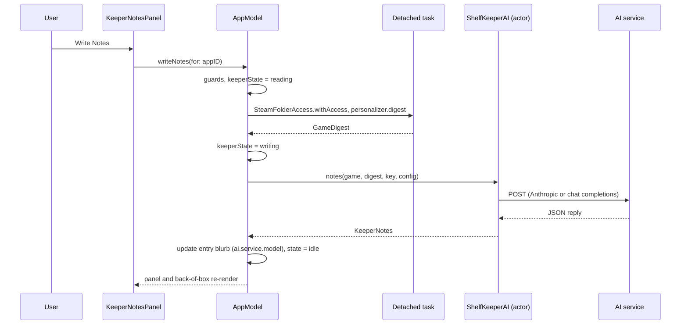

# AI writer (Shelf-Keeper)

The Shelf-Keeper is the feature that writes jokes about how you play. When the user presses **Write Notes** on a supported game, the app builds a text digest of the game's save files ([Personalizer](personalizer.md)), sends it with a fixed prompt to the AI service the user chose, parses the structured reply and stores the result on the entry (`BackOfBoxContent`) so it appears on the back of the box and in the notes panel. `ShelfKeeperAI` is an actor that speaks two wire formats (Anthropic's Messages API and OpenAI-compatible chat completions), so any service with either works. No model names are hard-coded except Anthropic's default, `claude-sonnet-5-5`; for every other service the app asks `GET <base>/models` and the user picks. Nothing is sent until the user asks for notes.

## Responsibilities

- Hold the user's service choice (`AIConfig`), per-service keys (Keychain), and the model list.
- Build requests for both wire formats, with provider-specific features gated by model.
- Parse replies tolerantly (code fences, prose wrappers, content parts) and map every failure to a clear `KeeperError`.
- Keep the voice and truth rules in one place (the system prompt) and the arithmetic out of the model (the digest's counted facts).
- Store notes with provenance: provider id, model, a fingerprint recording how many saves were read.

## How it works

### End to end



`AppModel.writeNotes` first checks: notes can be written here (`canWriteNotes`: normal mode, not demo, local shelf), a personalizer exists for the appID, no run is already in progress, the Steam folder is granted, `aiReady` (a key exists unless the preset needs none, a model is chosen, the base URL validates) and the key is present in the Keychain. Each failed check sets `keeperState[appID] = .failed(copy)`. Then it reads the digest on a detached task and calls `ShelfKeeperAI.notes`. On success it stores `BackOfBoxContent(blurb:, tagline:, providerID: config.contentProviderID, inputFingerprint: digest.fingerprint, generatedAt:, observations:, detail: playstyle)`. A cancellation returns to idle; any other error becomes `.failed(KeeperText.message(for:))`.

### Services and presets (`AIProviders`)

| id | Name | Wire | Base URL | Key | Key prefix |
|---|---|---|---|---|---|
| `anthropic` | Anthropic (Claude) | Anthropic | `https://api.anthropic.com/v1` | required | `sk-ant-` |
| `openai` | OpenAI | chat | `https://api.openai.com/v1` | required | `sk-proj-`, `sk-` |
| `gemini` | Google Gemini | chat | `https://generativelanguage.googleapis.com/v1beta/openai` | required | `AIza` |
| `openrouter` | OpenRouter | chat | `https://openrouter.ai/api/v1` | required | `sk-or-` |
| `groq` | Groq | chat | `https://api.groq.com/openai/v1` | required | `gsk_` |
| `mistral` | Mistral | chat | `https://api.mistral.ai/v1` | required | none |
| `xai` | xAI (Grok) | chat | `https://api.x.ai/v1` | required | `xai-` |
| `ollama` | Ollama (on this Mac) | chat | `http://localhost:11434/v1` | optional | none (editable address) |
| `custom` | Other (OpenAI-compatible) | chat | empty (editable address) | optional | none |

**Key-prefix detection.** Pasting a key calls `AIProviders.detect(fromKey:)`: the longest matching prefix wins (so `sk-ant-` and `sk-or-` beat OpenAI's plain `sk-`). If it identifies a service other than the current one, `AppModel.saveAIKey` switches `aiConfig` to that preset before storing the key, so pasting is all the user has to do. Keys without a distinctive prefix (Mistral) stay with the selected service.

**`AIConfig`** (`providerID`, `baseURL`, `model`; persisted as JSON in `UserDefaults`). `base` validates the endpoint: whitespace and trailing slashes are trimmed, a scheme and host are required, `https` is accepted anywhere, plain `http` only for `localhost`, `127.0.0.1` and `::1` (the Info.plist ATS key `NSAllowsLocalNetworking` permits the latter); anything else is `nil` and Settings shows "Use an https address (plain http works only for this Mac)." `contentProviderID` is `ai.<providerID>.<model>`, stored on the notes so a shelf records what wrote them (older notes use `anthropic.<model>`; both count as AI-written). Each service keeps its own key: Keychain account `anthropic-api-key` for Anthropic (the original account, so earlier keys carry over) and `ai-key-<id>` for the rest; `aiKeyProviders` mirrors which services have keys.

**Model list.** `loadModels()` runs when a key is saved, a provider is selected (and a key exists or none is needed), the Address field is submitted, or the refresh button is pressed. `GET <base>/models` with the right auth header; both wires answer `{"data": [{"id": ...}]}`; ids lose a `models/` prefix when present, are de-duplicated and sorted naturally (`alpha-2` before `alpha-10`). A result is ignored if the provider or base URL changed in the meantime. Failures show under the Model row.

### Request bodies

**Anthropic Messages API** (`makeRequest` and `requestBody`). `POST https://api.anthropic.com/v1/messages` (the endpoint is a constant; only the models request uses `AIConfig.base`), timeout 180 s, headers:

| Header | Value |
|---|---|
| `content-type` | `application/json` |
| `x-api-key` | the key |
| `anthropic-version` | `2023-06-01` |
| `anthropic-beta` | `server-side-fallback-2026-07-01`, only when `supportsDefaultFallbacks(model)` |

Body (JSON with sorted keys and unescaped slashes), exactly as `requestBody(game:digest:model:)` builds it, with `SYSTEM` and `USER` standing for the two prompts quoted below:

```json
{
  "fallbacks": "default",
  "max_tokens": 16000,
  "messages": [{ "content": "USER", "role": "user" }],
  "model": "claude-sonnet-5-5",
  "output_config": {
    "effort": "medium",
    "format": {
      "schema": {
        "additionalProperties": false,
        "properties": {
          "blurb": { "type": "string" },
          "drafts": { "items": { "type": "string" }, "type": "array" },
          "observations": { "items": { "type": "string" }, "type": "array" },
          "playstyle": { "type": "string" },
          "tagline": { "type": "string" }
        },
        "required": ["drafts", "tagline", "blurb", "observations", "playstyle"],
        "type": "object"
      },
      "type": "json_schema"
    }
  },
  "system": "SYSTEM"
}
```

Gating by model, so older or smaller models do not get fields they reject:

| Field | Included when | Rule |
|---|---|---|
| `fallbacks: "default"` and the `anthropic-beta` header | `supportsDefaultFallbacks(model)` | exact match: `claude-opus-5-5`, `claude-opus-5`, `claude-fable-5-1`, `claude-sonnet-5-5` |
| `output_config.effort: "medium"` | `supportsEffort(model)` | prefix match: `claude-opus-5`, `claude-sonnet-5`, `claude-fable-5`, `claude-mythos-5`, `claude-opus-4-6`, `claude-opus-4-7`, `claude-opus-4-8`, `claude-sonnet-4-6` (rejected by Haiku 4.5 and Sonnet 4.5 and earlier) |
| `output_config.format` (JSON schema) | always | structured output |

Never sent: `thinking`, `temperature`, `top_p`, `top_k` (a test asserts their absence). A model without the gated fields still gets the schema.

**OpenAI-compatible chat completions** (`makeChatRequest`). `POST <base>/chat/completions`, timeout 180 s, `content-type: application/json`, and `Authorization: Bearer <key>` only when the key is non-empty (keyless local servers work). Body (sorted keys):

```json
{
  "messages": [
    { "content": "SYSTEM + JSON_INSTRUCTION", "role": "system" },
    { "content": "USER", "role": "user" }
  ],
  "model": "<chosen model>",
  "response_format": { "type": "json_object" }
}
```

`JSON_INSTRUCTION` is appended to the system prompt: ` Reply with a single JSON object and nothing else, with exactly these keys: "drafts" (array of strings), "tagline" (string), "blurb" (string), "observations" (array of strings), "playstyle" (string).` No `max_tokens`, temperature or other sampling fields are sent, because their names and limits differ between services. **400/422 retry:** if the first request returns HTTP 400 or 422 (some compatible servers reject `response_format`), the app re-sends the identical request without `response_format`; the prompt alone still asks for JSON. The retry's response goes through `parseChat`, so a failing status on the retry raises its own error.

**Models request.** `GET <base>/models`, 30 s; Anthropic wire adds `x-api-key` and `anthropic-version`, compatible wire adds the Bearer header when a key exists.

### Response parsing

- **Anthropic** (`parse`): non-2xx maps by status (below). Then `stop_reason == "refusal"` gives `refused`, `"max_tokens"` gives `truncated`. The text is the concatenation of every content block with `type == "text"`, so thinking and fallback blocks are skipped. It must decode as `KeeperNotes { tagline, blurb, observations, playstyle }`; the `drafts` array is ignored, which is how the scratch pad is discarded. Strings are trimmed and blank observations dropped.
- **Chat** (`parseChat`): HTTP errors first; first choice; `finish_reason == "length"` gives `truncated`, `"content_filter"` gives `refused`; message content may be a string or an array of `{text}` parts, or a `refusal` string (`refused`). `decodeNotes(fromText:)` takes the substring from the first `{` to the last `}` (tolerating prose or a code fence), decodes, trims, and requires a non-empty `blurb` and at least one observation, else `malformed`.

### Errors and user copy

| `KeeperError` | Raised by | Message shown |
|---|---|---|
| `notConfigured` | empty model or invalid base URL | Choose an AI service and a model in Settings first. |
| `invalidKey` | 401 (Anthropic path), 401/403 (chat, models) | The AI service rejected the API key. Check it in Settings. |
| `rateLimited` | 429 | The AI service is rate-limiting this key. Try again in a minute. |
| `overloaded` | 529 and 5xx | The AI service is busy right now. Try again shortly. |
| `network` | `URLError` other than cancel, non-HTTP response | Couldn't reach the AI service. Check your connection and the address in Settings. |
| `refused` | refusal / content filter | The model declined to write about this one. |
| `truncated` | `max_tokens` / `length` | The notes ran too long and were cut off. Try again. |
| `malformed` | unparseable reply, missing fields | The Shelf-Keeper's reply wasn't readable. Try again, or pick a more capable model. |
| `http(status, message?)` | other non-2xx; message from `error.message`, `error` string or `message` | The AI service returned an error (status): message |

`AppModel` adds `KeeperText.noAccess` ("Steam Shelf doesn't have access to your Steam folder yet."), `KeeperText.noKey` ("Choose an AI service, key and model in Settings first.") and maps personalizer errors ("No save files were found for this game.", "The save files couldn't be read."). The notes panel shows the message in red with **Try Again** (and **Keep Old Notes** when earlier notes exist). Cancellation is not an error.

### The prompts, verbatim

Both are `static` members of `ShelfKeeperAI` and are sent unchanged. In the user prompt, `\(game)`, `\(digest.history)` and `\(digest.latest)` are Swift interpolations of the game's display name and the two digest sections ([Personalizer](personalizer.md)). The decision log ([Shelf-Keeper voice](../decisions/OPEN_QUESTIONS.md#shelf-keeper-voice-2026-10-04)) records why: the prompts were rewritten around comedy craft instead of adjectives (the log is the setup, the model writes the turn), and the truth rules were tightened after a live run produced funny but wrong lines.

**System prompt (`ShelfKeeperAI.systemPrompt`):**

```text
You are the Shelf-Keeper: the curator of a collector's wooden game shelf, who has read the owner's save files and has opinions. You write the notes that go on the box.

Voice: a best friend giving a wedding toast that keeps almost going too far. You roast choices, never the person. The teasing lands because it is obviously fond and because every detail is true. Speak to the player directly as "you".

How the jokes work:
- The log is the setup; your job is the turn. Never just report a fact. Give the detail, then say what it reveals, where it leads, or what it is suspiciously like.
- Specific beats general. The exact save name, the exact minute after midnight, the exact count. A real number is funnier than an adjective.
- Understate. Deadpan a ridiculous thing as if filing a report and let the reader do the laughing. Never explain a joke, never use exclamation marks, never call anything funny, ironic or hilarious.
- End each note on its strongest line and stop. No wrap-up sentence, no moral, no "in short".
- Vary the shape: a comparison, a mock-formal verdict, a question, the player's imagined inner monologue, a callback to an earlier note. Not five sentences built the same way.
- Aim at decisions (reloading, hoarding, abandoning a save for a year, naming a save in capitals), never at skill, intelligence or worth.

Truth rules, which are what keep it funny rather than random:
- Every factual detail must be in the log. Quote save names, dates and times exactly and do not invent events. The inference and the exaggeration are yours; the facts are not.
- Numbers are facts. The log has a section of figures already counted for you: use those. Do not count rows, add up saves or work out the minutes between two times yourself; if the figure you want is not given, say it without a number ("later that night", "again"). Never reuse a number for something it does not measure.
- Never show an internal identifier (anything with underscores, like a quest or dialogue code). Say what it is in a player's words.
- A word the player typed in a save name may be a character's name, a typo or a private joke. Unless you are certain which, play with the wording as written and do not explain what it means or call it a mistake.
- The log uses the game's internal quest and dialogue names. Translate them into what a player would recognise, and do not reveal story beyond what the log shows the player has reached.
- Before finishing, reread each line against the log and cut or fix anything you cannot point to.
Plain text only: no markdown, no emoji.

The register, from notes on other people's shelves (match the tone, do not reuse the jokes):
- You saved at 2:14 a.m. under the name "ok last try". There are eleven saves after it.
- Forty hours in, the horse has a better inventory than you do. You have named the horse. You have not named your character.
- You quit for nine months in the middle of a boss fight. He has been standing there the whole time. He has had a while to think about what he did.
- Three saves are called "before". None are called "after". I think we both know how "before" went.
- You have spoken to every dog in the city and one mayor.
```

**User prompt (`ShelfKeeperAI.userPrompt(game:digest:)`):**

```text
Game: \(game)

== SAVE HISTORY ==
\(digest.history)

== MOST RECENT SAVE ==
\(digest.latest)

Write:
- drafts: your scratch pad. Ten quick candidate jokes, one line each, each about a different detail in the log. Be loose; most will be cut.
- tagline: six words or fewer. The title of the roast.
- blurb: one line, 160 characters or fewer: the single funniest true thing, for the back of the box.
- observations: the best five or six drafts, rewritten until each one lands. One to three sentences each. Mine the patterns over time: long gaps, reloads (playtime going backwards), save names the player typed themselves, late-night sessions, who is always or never in the party.
- playstyle: a character reading of this player, not a summary. Open with a verdict on what kind of player this is, back it with two or three details from the most recent save's quests, conversations and dice rolls, and end on the sharpest line. Three or four sentences.
```

### The `drafts` scratch pad

`drafts` is the first field the model is asked for (first in the schema's `required` list and in the prompt's `Write:` list): ten quick candidate jokes, each about a different detail. The `observations` are the best of them rewritten. The app never stores or shows `drafts`; `KeeperNotes` has no such field, so decoding drops it. The decision log describes it as a scratch pad whose best entries are rewritten into the observations. `tagline` (six words or fewer) and `blurb` (160 characters or fewer) appear on the back of the box; `observations` and `playstyle` ("a character reading ... end on the sharpest line") fill the notes panel under "ON YOUR MOST RECENT SESSION".

### What is sent, and when (privacy)

- **When:** only after an explicit press of **Write Notes**, **Rewrite** or **Try Again** for one game. Loading the model list sends only the key. Nothing is sent at launch, on opening a box, or in the background. The Settings footnote states this.
- **What:** the system prompt, the game's display name, and the digest: save names (including names the player typed), dates and clock times, hero and companion names, class and level, quest and dialogue names, dice-roll tallies, the time-zone identifier. The key goes in a header to the service the user chose.
- **Not sent:** Steam ID, persona name, the Steam Web API key, ratings, notes, purchase dates, other games, file paths, or any raw save file.
- **Where:** the endpoint of the chosen service (or a local Ollama address). The session is ephemeral (`URLSessionConfiguration.ephemeral`: no cookies, no disk cache). The key stays in the Keychain; responses are stored only as the notes on the entry (and so appear in exports of the shelf).

### Cost and latency

From the decision log ([Sonnet 5.5 default...](../decisions/OPEN_QUESTIONS.md#sonnet-55-default-counted-facts-save-time-zone-2026-10-04) and [Shelf-Keeper voice](../decisions/OPEN_QUESTIONS.md#shelf-keeper-voice-2026-10-04)):

| Model | Run on a real 118-save library | Notes |
|---|---|---|
| Claude Opus 5.5 | about 12.6k input and 6k output tokens, roughly 17 cents, 40 to 70 seconds | Still selectable in Settings |
| Claude Sonnet 5.5 (default since 2026-10-04) | about 14 seconds and 4 cents | Miscounted when left to do arithmetic, hence "counted for you" |

Request timeout is 180 s. Live testing covered Anthropic only; other services are covered by offline request/response tests ([Any AI service](../decisions/OPEN_QUESTIONS.md#any-ai-service-2026-10-01)).

## Key types

| Type | File | Role |
|---|---|---|
| `ShelfKeeperAI` | `Personalizer/ShelfKeeperAI.swift` | Actor: prompts, requests, parsing |
| `KeeperNotes`, `KeeperError` | same | Result and errors |
| `AIWire`, `AIProviderPreset`, `AIProviders`, `AIConfig` | `Personalizer/AIProvider.swift` | Services and the user's choice |
| `BackOfBoxContent` | `BackOfBox/BackOfBoxProvider.swift` | Where notes are stored (`isAIWritten`, `savesRead`) |
| `KeeperText`, `AppModel.KeeperState`, `AppModel.writeNotes` | `App/AppModel.swift` | Orchestration and copy |
| `KeeperNotesPanel` | `BackOfBox/KeeperNotesPanel.swift` | UI |
| `Keychain` | `Persistence/Keychain.swift` | Per-service keys |

## Concurrency and isolation

`ShelfKeeperAI` is an `actor` with its own ephemeral `URLSession`; request builders and parsers are pure `static` functions callable without `await`. `KeeperNotes`, `KeeperError`, `GameDigest` and `AIConfig` are `Sendable` value types, so they cross between the digest task, the actor and the main-actor model. `writeNotes` runs on the main actor, hops to a detached task for the file work, awaits the actor, then updates the document back on the main actor. Cancellation (`CancellationError` or `URLError.cancelled`) is mapped to `CancellationError` and ends in `.idle`.

## Failure modes and how they surface to the user

See "Errors and user copy". Additional notes: a missing key or access is reported before any work starts; a half-finished run leaves the previous notes untouched (they are replaced only on success); a failed rewrite offers **Keep Old Notes**; the model list failing does not block typing a model name by hand; entering a plain-http non-local address is rejected by validation rather than by the network.

## Tests

`ShelfKeeperAITests` (Anthropic request body shape and headers, parsing that skips thinking blocks, refusal and truncation, HTTP error mapping, malformed replies) and `AIProviderTests` (key prefix detection, base URL validation, chat request shape, chat parsing including fenced JSON and content parts, model list request and parsing, feature gating by model, both provider-id styles). `KeeperModelTests` covers `blurbIfNeeded` and notes clearing. See [Tests](../reference/Tests.md).

## Related decisions

[Any AI service (2026-10-01)](../decisions/OPEN_QUESTIONS.md#any-ai-service-2026-10-01), [Shelf-Keeper voice (2026-10-04)](../decisions/OPEN_QUESTIONS.md#shelf-keeper-voice-2026-10-04), [Sonnet 5.5 default, counted facts, save time zone](../decisions/OPEN_QUESTIONS.md#sonnet-55-default-counted-facts-save-time-zone-2026-10-04), [Shelf-Keeper notes](../decisions/OPEN_QUESTIONS.md#shelf-keeper-notes). Q8 ("not built, key in Keychain under `ai-api-key`") is superseded: the key account is `anthropic-api-key` / `ai-key-<id>`, and the seam is `ShelfKeeperAI`, not `AIBackOfBoxProvider`.

## Reference

[ShelfKeeperAI](../reference/ShelfKeeperAI.md), [AIProvider](../reference/AIProvider.md), [BackOfBoxProvider](../reference/BackOfBoxProvider.md), [KeeperNotesPanel](../reference/KeeperNotesPanel.md), [AppModel](../reference/AppModel.md), [Keychain](../reference/Keychain.md), [SettingsView](../reference/SettingsView.md), [GamePersonalizer](../reference/GamePersonalizer.md), [Tests](../reference/Tests.md).
