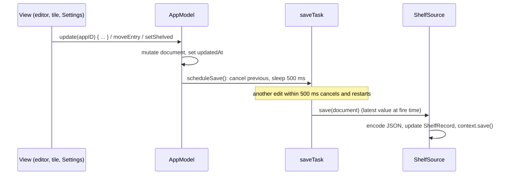

# App and state

The app layer is one entry point (`SteamShelfApp`) and one state object (`AppModel`). `AppModel` is a `@MainActor @Observable` class that owns the `ShelfDocument`, the cached Steam library, navigation, configuration mirrored from `UserDefaults` and the Keychain, and every workflow that changes them. Views read it through the environment and call its methods; they never touch the network, Keychain or disk. Persistence is deliberately boring: the document is encoded to JSON and stored as one SwiftData blob, saved 500 ms after the last change, and the library is a separate JSON file in Application Support.

## Responsibilities

- Decide the launch mode and build the SwiftData container and the model (`SteamShelfApp.init`).
- Hold and mutate the document: ticking games, editing ratings and notes, reordering, retitling.
- Run account workflows: save/forget the Steam key, connect, refresh the library, refresh achievements.
- Hold AI configuration and per-game Shelf-Keeper state (the workflow itself is in [AI writer](ai-writer.md)).
- Hold navigation and open-box state, and the transient base-rail status message.
- Persist (debounced), export and import the shelf; mirror secrets' presence in `UserDefaults`.
- Expose the local-Steam facts the UI needs (installed or not, can launch).

## How it works

### Startup

`SteamShelfApp.init` computes `mode` (`.tests` if `XCTestConfigurationFilePath` is set, else `.normal`) and `startDemo` (`--demo` in `CommandLine.arguments`). It creates `ModelContainer(for: ShelfRecord.self, configurations: ModelConfiguration(isStoredInMemoryOnly: mode != .normal))` (a failure is `fatalError`), builds `AppModel(mode:container:startDemo:)`, and in `.normal` mode touches `Updater.shared` so Sparkle starts. The scene is one `Window("Steam Shelf", id: "shelf")` (hidden title bar, default 1180 x 960, `contentMinSize` resizability) plus a `Settings` scene. `ShelfView` runs `.task { prepare textures; await model.onLaunch() }`.

`AppModel.init` branches on mode. In `.normal` it reads all persisted values, sets `hasSaveAccess` from the bookmark, and uses `LocalShelfSource`. In `.tests` everything is a default and the source is an in-memory `DemoShelfSource`. `document` starts empty in both; `startDemo` replaces it.

`onLaunch()` (skipped in tests mode and in demo): loads the stored document, loads the library cache for the resolved SteamID, clamps the page, and refreshes the library if a key and SteamID exist and the cache is missing or older than 6 hours (`OwnedLibraryCache.isStale`).

### Launch flags

| Flag | Build | Effect |
|---|---|---|
| `--demo` | all | Start on the demo shelf as a normal launch. Settings and Leave Demo work as usual; `onLaunch` returns early. |
| `--demo-notes` | DEBUG | With the demo, give the first shelved entry sample Shelf-Keeper notes (`DebugNotes.sample`). |
| `--dump-digest <appid>` | DEBUG | In `onLaunch`, build the personalizer digest for that app and write `<Caches>/SteamShelf/digest-<appid>.txt` (history, latest, fingerprint, save count). No AI call. Needs the Steam folder grant. |
| `XCTestConfigurationFilePath` (environment) | all | Tests mode. |

### Properties grouped by concern

| Concern | Properties |
|---|---|
| Mode | `mode` (`let`), `isDemo` (derived from `source.sourceID == "demo"`) |
| Steam account | `steamIDInput` (persisted), `resolvedSteamID` (persisted), `hasAPIKey` (mirror), `playerSummary` (persisted JSON), `libraryState` |
| AI configuration | `aiConfig` (persisted JSON), `aiKeyProviders` (mirror set), `hasAIKey`, `aiReady`, `availableModels`, `modelsState` |
| Saves access and time | `hasSaveAccess`, `saveTimeZoneID` (persisted), `saveTimeZone` |
| Data | `source`, `document`, `library` |
| Navigation | `pageIndex`, `slideDirection`, `pagination` (computed) |
| Open box | `openedAppID`, `openedFromFrame`, `isEditingLabel`, `isShowingNotes` |
| Shelf-Keeper | `keeperState: [Int: KeeperState]`, `canWriteNotes` |
| Look | `lightsOn` (persisted) |
| Local Steam client | `installedAppIDs`, `steamAvailable`, `canLaunchGames`, `transientStatus` |
| File flows | `isExporting`, `exportFile`, `isImporting`, `pendingImport`, `fileAlert` |
| Services | `steam` (`SteamClient`), `images` (`ImageCache`), `backOfBox` (`LocalBackOfBoxProvider`) |

Persisted keys in `UserDefaults`: `steamIDInput`, `resolvedSteamID`, `hasAPIKey`, `hasAIKey` (legacy), `aiKeyProviders`, `aiConfig`, `saveTimeZone`, `playerSummary`, `shelfLights`; plus `steamFolderBookmark` owned by `SteamFolderAccess`. Writes happen in `didSet` and only in `.normal` mode.

### Public methods by area

| Area | Methods |
|---|---|
| Lifecycle | `onLaunch()` |
| Steam key | `saveAPIKey(_:)`, `forgetAPIKey()` |
| AI | `saveAIKey(_:)` (detects service from prefix), `selectAIProvider(_:)`, `loadModels()`, `forgetAIKey()`, `writeNotes(for:)`, `clearNotes(for:)`, `keeperState(for:)` |
| Save access | `requestSaveAccess()`, `revokeSaveAccess()` |
| Library | `connect()`, `refreshLibrary(manual:)`, `refreshStats(for:force:)`, `refreshAllStats()` |
| Selection | `isShelved(_:)`, `setShelved(_:_:)`, `setAllShelved(_:appIDs:)` |
| Editing | `update(_:_:)` (the single choke point for entry edits) |
| Arrangement | `moveEntry(_:before:)`, `arrangeAlphabetically()`, `isCustomArranged` |
| Paging | `go(to:animation:)`, `handleTapped(_:)`, `dragHover(over:active:)` |
| Open box | `open(_:from:)`, `close()` |
| Steam client | `installState(for:)`, `refreshInstalls()`, `launch(_:)`, `showTransient(_:seconds:)` |
| Lights | `toggleLights()` |
| Demo | `startDemo()`, `leaveDemo()` |
| Export/import | `exportData()`, `beginExport()`, `beginImport()`, `stageImport(_:)`, `confirmImport()`, `importDocument(_:)` |
| Back of box | `blurbIfNeeded(for:)` |

Full signatures and behaviour: [AppModel reference](../reference/AppModel.md).

### Change, then save

`scheduleSave()` is a no-op in tests mode. Failures are only logged. There is no flush on quit, so an edit in the last half second before termination can be lost.

### The document model

`ShelfDocument`: `version` (1), `id`, `title`, `owner`, `createdAt`, `updatedAt`, `entries`, `arrangement`. `ShelfEntry`: `appID`, `title`, `isShelved`, `rating` (1 to 5, nil unrated), `note` (600 characters max, enforced by the editor), `purchaseDate`, `firstSeenAt`, `stats` (`CachedSteamStats`), `art` (`ArtRefs`), `blurb` (`BackOfBoxContent?`). Notes on semantics:

- `entries` includes unticked games. Unticking sets `isShelved = false` and keeps rating, note and blurb, so a misclick loses nothing; ticking restores them. `shelvedEntries` is what the UI paginates; `forSharing()` drops the rest from exports.
- `BackOfBoxContent` (`blurb`, `tagline`, `providerID`, `inputFingerprint`, `generatedAt`, `observations?`, `detail?`) holds either the local template text (`providerID == "local.v1"`) or Shelf-Keeper notes (`ai.<service>.<model>` or the older `anthropic.<model>`). `isAIWritten` is true for the latter two prefixes; `savesRead` parses the count out of an AI fingerprint (`"<saveCount>:<mtime>"`). New optional fields decode as nil from older documents.
- `blurbIfNeeded(for:)` never replaces AI notes; it regenerates the template only when its fingerprint (playtime bucket, achievements, rating) changed, so typing a note never reshuffles the joke.
- `mergeLibraryIntoEntries` refreshes only Steam-owned fields (`title`, playtime, last played, community-stats flag, art URLs). It never adds entries, never changes `isShelved`, and never touches `rating`, `note`, `purchaseDate` or `blurb`.

Codec: `ShelfDocumentCodec.encode` uses `.iso8601` dates and `[.prettyPrinted, .sortedKeys]`; `decode` first probes `version` and throws `DocumentError.unsupportedVersion(n)` for `n > 1` before the full decode. Unknown keys are ignored. Dates lose sub-second precision.

### Pagination and arrangement

`Pagination` is a value computed from `shelvedEntries.count`: 4 columns by 4 rows, 16 per page, at least one page, everything clamped. `AppModel.go(to:)` clamps, sets `slideDirection` in the same transaction as the animated `pageIndex` change (so the `.push` transition reads the right edge), and is synchronous so tests can call it. `handleTapped` reads `NSApp.currentEvent?.clickCount`: a double click jumps to the first or last page with the `pageJump` spring. After every selection or arrangement change `finishShelfMutation()` bumps `updatedAt`, re-clamps `pageIndex` and schedules a save.

Arrangement is alphabetical until the user drags a box. `ShelfDocument.move(appID:before:)` takes the entry out and re-inserts it before the target (or at the end), and flips `arrangement` to `.custom`; from then on the order of `entries` *is* the arrangement, new games are appended (`insert`), and **Shelf > Arrange Alphabetically** (enabled only when custom) re-sorts with `localizedStandardCompare` and resets the flag. Hovering a drag over a handle for 450 ms flips a page (`dragHover`) so a box can cross pages. Q2 in the [open questions](../decisions/OPEN_QUESTIONS.md) records the decision (2026-09-30).

### Persistence

| Store | Type | Details |
|---|---|---|
| `ShelfRecord` (SwiftData) | `@Model`: `shelfID` (unique), `kindRaw` (`"local"`), `updatedAt`, `documentData` | One local record; `LocalShelfSource` fetches by `kindRaw`, `save` updates or inserts, then `context.save()`. The blob decision is Q4: the document is the schema, per-game tables would only pay off with thousands of entries or cross-shelf queries. |
| `ShelfSource` protocol | `@MainActor`: `sourceID`, `isEditable`, `load()`, `save(_:)` | Implemented by `LocalShelfSource` (`"local"`) and `DemoShelfSource` (`"demo"`, memory only). `canLaunchGames` and `canWriteNotes` require `sourceID == "local"`. |
| `LibraryStore` | JSON file `<Application Support>/SteamShelf/library-<digits>.json` | `OwnedLibraryCache`: `steamID64`, `fetchedAt`, `games`, `firstSeen`, `assets`. Written atomically after each refresh. Not in Caches because `firstSeen` is irrecoverable. |
| `Keychain` | generic password items | See below. |

### Export and import

Export: the File menu item Export Shelf... (Cmd-Shift-E) calls `beginExport()`, which encodes `document.forSharing()` and wraps it in `ShelfFile`; `ShelfView`'s `fileExporter` (type `net.outofajam.steamshelf`, extension `.steamshelf`, default name the shelf title) writes it. Import Shelf... (Cmd-Shift-I): `fileImporter` reads the file under a security scope, `stageImport` decodes it to validate (version and shape) and stores `pendingImport`; a "Replace this shelf?" alert confirms; `confirmImport` calls `importDocument`, which swaps `document`, clamps the page and schedules a save. Failure copy: "That shelf was made by a newer version of Steam Shelf (format N).", "That file isn't a Steam Shelf document.", "Couldn't import that shelf.", "Couldn't read that file.", "Couldn't write the shelf file.", "Couldn't prepare the shelf for export."

### Keychain accounts

Service `net.outofajam.SteamShelf`, accessibility `AfterFirstUnlock`, file-based login keychain (the data-protection keychain needs a team ID entitlement).

| Account | Holds |
|---|---|
| `steam-web-api-key` | Steam Web API key |
| `anthropic-api-key` | Anthropic key (the original single-key account, kept so earlier keys carry over) |
| `ai-key-<providerID>` | Key for OpenAI, Gemini, OpenRouter, Groq, Mistral, xAI, Ollama or custom |

Launch never reads the Keychain: `hasAPIKey` and `aiKeyProviders` are `UserDefaults` mirrors (so a locked or re-prompting Keychain cannot block startup), and keys are read only when connecting, refreshing, loading models or writing notes.

## Key types

| Type | File | Role |
|---|---|---|
| `SteamShelfApp`, `ShelfCommands`, `ShelfFile` | `App/SteamShelfApp.swift` | Entry point, menu, file document |
| `Updater`, `UpdateCommands` | `App/Updater.swift` | Sparkle wrapper |
| `AppModel`, `LaunchMode`, `LoadState`, `SlideDirection`, `KeeperText` | `App/AppModel.swift` | State and workflows |
| `ShelfDocument`, `ShelfEntry`, `CachedSteamStats`, `ArtRefs`, `ShelfOwner`, `ShelfDocumentCodec` | `Model/ShelfDocument.swift` | Schema |
| `BackOfBoxContent`, `BackOfBoxContext` | `BackOfBox/BackOfBoxProvider.swift` | Stored text and its inputs |
| `Pagination`, `HandleSide` | `Model/Pagination.swift` | Paging math |
| `ShelfRecord`, `ShelfSource`, `LocalShelfSource`, `DemoShelfSource` | `Persistence/ShelfStore.swift` | Storage |
| `OwnedLibraryCache`, `LibraryStore` | `Persistence/LibraryStore.swift` | Library cache |
| `Keychain` | `Persistence/Keychain.swift` | Secrets |
| `DemoData` | `Demo/DemoData.swift` | Demo shelf |

## Concurrency and isolation

- `AppModel` is `@MainActor`; every method above runs on the main actor. Network and image work is delegated to the `SteamClient` and `ImageCache` actors and the results (`Sendable` DTOs) are applied back on the main actor.
- `refreshAllStats` fans out four `refreshStats` calls at a time with `withTaskGroup`; each child task calls the main-actor model, so only the network waits overlap.
- `writeNotes` hops to a detached `userInitiated` task for file reading (`SteamFolderAccess.withAccess` is `nonisolated`), then back to the main actor to write the result.
- `ShelfSource` is `@MainActor` because SwiftData's `mainContext` is.
- `launch(_:)` uses `NSWorkspace.openApplication` with a completion handler that hops back with `Task { @MainActor in ... }`.
- `saveTask`, `dwellTask` and `transientTask` are cancellable `Task`s; each new request cancels the previous one.

## Failure modes and how they surface to the user

| Failure | Result |
|---|---|
| Steam key missing or rejected | `libraryState = .failed("Add your Steam Web API key first." / "Steam rejected that API key...")` in the base rail and Settings |
| Private game list, rate limit, HTTP or network errors | Mapped by `SteamError.userMessage` ([Steam](steam.md)) |
| Cancellation | `libraryState = .idle` (not an error) |
| Keychain save fails | Steam key: "Couldn't save the key in your Keychain." AI key: log only |
| Achievements fetch fails (not private, not "no stats") | Silent (debug log); the label keeps showing "Checking the trophy case..." |
| Stored shelf blob cannot be decoded (corrupt, or newer version) | `onLaunch` uses `try?`, so the shelf looks empty; the next edit overwrites the blob. No warning is shown |
| Library cache cannot be decoded | Looks like no cache; a refresh rebuilds it and `firstSeen` history restarts |
| Debounced save throws | Logged only |
| Import problems | Alert with the specific message above |
| Shelf-Keeper preconditions or errors | `keeperState[appID] = .failed(KeeperText.message(for:))`, shown in the notes panel |
| Play fails to open the bundle | Falls back to `steam://rungameid/<id>` and says so in the base rail |
| Demo or tests mode | Network, Keychain and persistence methods return early (`guard mode == .normal, !isDemo`) |

## Tests

`ShelfDocumentTests` covers round trips, version refusal, unknown keys, sharing, move/insert/arrangement semantics, sorted insert, the local blurb provider, `LocalShelfSource` save and load on an in-memory container, and `AppModel` in tests mode (no-op `onLaunch`, demo toggle, unticking keeps data, page clamps). `PaginationTests` covers the paging math. `KeeperModelTests` covers `BackOfBoxContent` decoding and `blurbIfNeeded`/`clearNotes` behaviour. See [Tests](../reference/Tests.md).

## Related decisions

[Phase A notes](../decisions/OPEN_QUESTIONS.md#implementation-notes-phase-a) (SteamID parsing rule, Keychain mirror, export/import flags), Q2 (drag to reorder), Q4 (blob), Q5 (keep notes when unticked), Q6 (whole stars; half stars would be a version bump), Q10 (signing and Keychain prompts; superseded for Debug and Release by Developer ID, see [Distribution](distribution.md)), Q11 (shelf title), Q13 (6 h refresh), Q17 (demo mode), [Shelf-Keeper notes](../decisions/OPEN_QUESTIONS.md#shelf-keeper-notes) (notes only on the local shelf outside demo).

## Reference

[SteamShelfApp](../reference/SteamShelfApp.md), [AppModel](../reference/AppModel.md), [Updater](../reference/Updater.md), [ShelfDocument](../reference/ShelfDocument.md), [BackOfBoxProvider](../reference/BackOfBoxProvider.md), [Pagination](../reference/Pagination.md), [ShelfStore](../reference/ShelfStore.md), [LibraryStore](../reference/LibraryStore.md), [Keychain](../reference/Keychain.md), [DemoData](../reference/DemoData.md), [SteamIDInput](../reference/SteamIDInput.md), [Tests](../reference/Tests.md).
