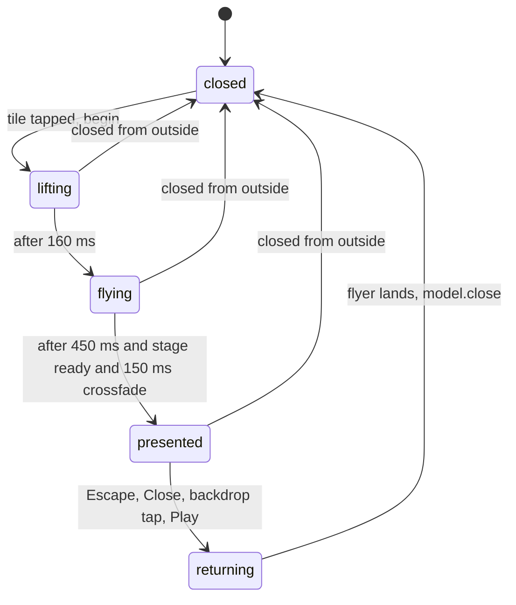
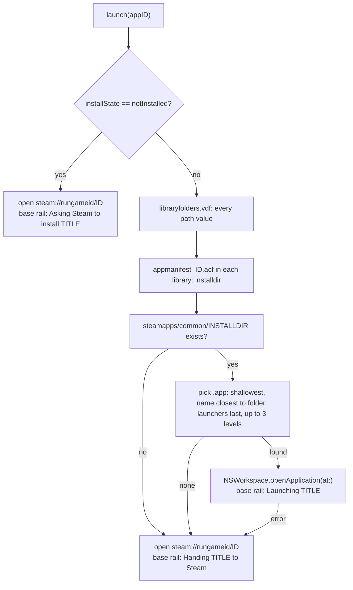

# Open box

Clicking a box on the shelf opens it: the tile lifts, a 2D copy ("the flyer") flies to the middle of the bay while the rest dims, and then cross-fades into a real 3D box (RealityKit) that can be dragged to spin, flipped to its back, and acted on (edit the label, read the Shelf-Keeper's notes, Play or Install the game). `OpenBoxView` owns the whole sequence as a small phase machine; the 3D part is `BoxScene.swift`; the printed label and both side panels are in `BackOfBox/`. The 3D scene exists only while a box is open, so the shelf itself stays cheap (this is decision Q3).

## Responsibilities

- Animate open and close between the tile's position and the stage, without ever covering the case frame.
- Build the three box textures (front cover, back label, spine) and keep the back in sync with edits.
- Provide the toolbar (Play/Install, Flip, Edit Label, Notes, Close) and keyboard control.
- Render the printed back of the box and host the two side panels.
- Launch the game: directly through its app bundle when possible, otherwise via Steam.

## How it works

### Phase machine

`OpenPhase` is `closed, lifting, flying, presented, returning`. The overlay does nothing while `closed`. Opening starts when `model.openedAppID` becomes non-nil (a tile calls `model.open(appID, from: frame)`, where `frame` is the tile's rect in `shelfSpace`).

### Timeline of an open

| t | What happens |
|---|---|
| 0 | `begin()`: `generation += 1`; take the cover from `CoverLoader.recent` (or render a placeholder); reset motion; place the flyer at the tile frame with animation disabled. Textures start building on the main actor after one `Task.yield()`. |
| 0 to 160 ms | Phase `lifting`: flyer scales to 1.08 with a bigger shadow (`Theme.Motion.lift`). |
| 160 ms | Phase `flying`: flyer springs to `targetRect` (`Theme.Motion.fly`), backdrop dims to 70% over 450 ms. |
| about 610 ms | `present()`: wait (up to 4 s) for the `RealityView` to report ready, cross-fade flyer out and stage in over 150 ms. |
| about 760 ms | Phase `presented`: idle bob enabled, focus taken, toolbar fades in, `refreshInstalls()`, then `refreshStats(for:)` (6 h TTL) and `blurbIfNeeded(for:)`. |

Reduce Motion skips lift and fly: the flyer jumps to the target and only the dim and cross-fade animate. Closing reverses it: panels and toolbar hide, `BoxMotion.returnToFront()` springs the box to yaw 0 (waiting at most 0.6 s for it to settle), the flyer cross-fades back in, springs home to `model.openedFromFrame`, the dim fades out over 380 ms and `finish()` calls `model.close()`.

### The generation counter

Every timed step is `Task.sleep` followed by `guard gen == generation`. A new `begin()`, or `hardReset()` (the model closed the box from outside, for example leaving the demo), increments `generation`, which orphans any sequence still sleeping. The author chose sleeps over animation completion handlers because a completion that never fires (when no value actually changes) would leave the overlay stuck. `.id(generation)` on the stage also gives each open a fresh `RealityView`.

### Geometry: stage confined to the bay

All geometry is derived from the overlay size and `Theme.Metrics`, not plumbed from the bay view:

- `bayRect`: x = `stileW` (84), y = `crownH` (64), width = overlay width minus two stiles, height = overlay height minus crown and base (44).
- `stageSide = max(160, min(bay.width - reserved, bay.height - 100))` with `reserved = 80` normally, or `panelWidth + 60` when a side panel is open (340 for the editor, 380 for notes). The stage is a square centred in the bay (horizontally in the bay minus the panel strip), so the box and its toolbar never overlap the crown, base or stiles.
- `targetRect`: the front face is `Theme.Metrics.frontFaceFill` (0.628) of the stage side tall (width 2/3 of that), centred on the stage. 0.628 is *measured*: with the camera at z = 0.85 and a 30 degree field of view the rendered front face fills 0.628 of the square stage, not the 0.676 the formula predicts. Using the measured value makes the 2D flyer and the 3D front coincide at the cross-fade.
- The flyer's rect lives in `shelfSpace`, so it is shifted by the overlay's origin when drawn. The opened tile keeps `model.openedFromFrame` live so resizing while open still lands the box in its slot.
- Side panels are placed at the bay's trailing edge, 16 pt in, with height `bay.height - 32`. With the editor open at the minimum window (820 x 700) the stage is only about 252 pt square; this was accepted.
- The toolbar sits 24 pt below the front face, centred on the stage.

### The 3D box (`BoxScene.swift`)

`BoxStageView` wraps a `RealityView`. On creation it adds a root entity, a `PerspectiveCamera` (field of view 30 degrees, position (0, 0, 0.85)), a key `DirectionalLight` (intensity 2800 from (-0.5, 0.7, 1.0)) and a fill light (900 from (0.8, -0.1, 0.6)), creates three `TextureResource`s from `CGImage`s (colour semantic, mipmaps generated) and builds the box with `BoxBuilder.makeBox`: **six single-sided planes** (0.20 x 0.30 x 0.044 m; depth is 22% of width, the "chunky collector's box" of Q15) with front (roughness 0.35, clearcoat 0.6 for the shrink-wrap look), back (0.6), left and right (the spine texture, 0.5) and top and bottom (a tinted edge material in the spine colour). Plane meshes face +Z, so each is rotated to face outward. It then subscribes to `SceneEvents.Update` and calls `onReady()`.

`BoxMotion` is the per-frame state. It is `@MainActor` but not `@Observable`: it changes every frame and no view should re-render from it. `step(dt:root:)` (dt clamped to 50 ms) advances yaw and pitch:

- dragging sets yaw by 0.012 rad per point and pitch by 0.008 rad per point (pitch clamped to +-0.45); release hands the gesture velocity to an inertia that decays by `0.04^dt` per second;
- `flip()`, left/right arrows (quarter turns), `showBack()` and `returnToFront()` set a `targetYaw` the yaw springs toward (rate 8, or 14 when returning); targets are chosen as the nearest multiple of 2 pi (front) or pi offset (back) so flips never unwind several turns;
- pitch always relaxes toward 0;
- when idle (enabled after presentation unless Reduce Motion, not dragging, no velocity, no target) a slow bob (6 mm, 3.2 s period) and drift (2.5 degrees, 7 s) blend in with rate 5.

`isSettled` (target nil, yaw and pitch within 0.02, velocity under 0.05) is what the close sequence polls. The RealityKit camera is honoured on macOS 26 and the view composites transparently over SwiftUI, so no fallbacks (root offset, backdrop) were needed ([Phase B notes](../decisions/OPEN_QUESTIONS.md#implementation-notes-phase-b)); `BoxMotion.rootZ` stays 0.

### Textures from `ImageRenderer`

The front is the cover already on the shelf. The back is `BackOfBoxView` and the spine is `SpineView`, both rendered by `ArtGenerator.render` (`ImageRenderer` at 2x on the main actor; about tens of milliseconds, overlapped with the lift) to 600 x 900 and 200 x 1200 canvases. `buildTextures` is called once per open. When the entry changes while open (rating, note, purchase date, new notes) `scheduleBackRender()` re-renders only the back after a 150 ms debounce, stores it in `textures.back` and increments `backVersion`; `BoxStageView`'s `.task(id: backVersion)` builds a new `TextureResource` and swaps the material of the stored back entity. `backVersion` only ever increases, so the task runs once per change and a cancelled task cannot apply a stale texture.

### The printed back (`BackOfBoxView`)

A 544 x 844 cream paper label on the spine-coloured back panel, rendered as an image and never shown directly: title and optional tagline; "YOUR VERDICT" stars (or "Not yet rated"); a 2 x 2 grid (purchased, hours played, last played, on shelf since); achievements (a green progress bar, or "This game keeps no trophies.", "Achievements are private on Steam.", "Checking the trophy case..."); "FROM THE SHELF-KEEPER" with the blurb (5 lines, scale to 0.7; shows "The shelf-keeper is thinking it over..." until `blurbIfNeeded` finishes); a lined note card with a thumbtack (6 lines); a barcode generated from the appID and "A STEAM SHELF EXHIBIT . <OWNER>". Purchase date is manual because Steam's Web API does not expose it (Q1).

### Label editor and Keeper notes

Both panels slide in from the bay's trailing edge as cream clipboards with a brass clip and force the light colour scheme. Opening either one calls `motion.showBack()` so the box turns to the back; opening one closes the other.

- `LabelEditorPanel`: star control (click to set, same star to clear), purchase date (field-style `DatePicker` with Clear, or **Set date**), note (`TextEditor`, 600 characters enforced on every keystroke with a counter), **Refresh from Steam** (`refreshStats(force: true)`; disabled in demo), **Done**. Every edit is `model.update(appID) { ... }`, so it saves like any other change and triggers the back re-render.
- `KeeperNotesPanel`: its body is a function of `model.keeperState(for:)`, `canWriteNotes`, `hasSaveAccess` and `aiReady`: reading or composing spinner; failure with **Try Again** (and **Keep Old Notes** when notes exist); stored notes (tagline, observations with fleurons, "ON YOUR MOST RECENT SESSION" paragraph, a footer "Written <date> . N saves read" with **Rewrite**, **Clear** after confirmation, **Done**); or the step the user still has to take (**Grant Access...**, **Open Settings**, **Write Notes**). The Notes button appears only when AI notes already exist, or when the shelf is the writable local one and a personalizer exists for the game. How notes are produced: [AI writer](ai-writer.md).

### Play and Install

The toolbar shows **Play** (brass pill) or **Install** only when `model.canLaunchGames`: normal mode, not demo, a Steam client is registered for `steam://` (`NSWorkspace.urlForApplication(toOpen: steam://)`), and the shelf is the local one. The label comes from `installState(for:)`: `installed` and `unknown` say Play, `notInstalled` says Install. A double-click on the 3D stage does the same as the button; either calls `model.launch(appID)` and then closes the box.

Install state is read from the Steam client's own files (the sandbox has a read-only temporary exception for `~/Library/Application Support/Steam/steamapps/`; the real home is found with `getpwuid` because the sandbox's `NSHomeDirectory` is the container):

`SteamInstalls.scan()` parses every `"apps"` block of `libraryfolders.vdf` (which covers other volumes) into a set of installed IDs; if the file is unreadable the set is `nil` and the button simply says Play and lets Steam sort it out. Bundle choice scores the app name against the install folder's name after lower-casing and stripping non-alphanumerics: equal 0, containment 1, other 2, names containing "launcher" 3, after sorting by depth. The status message shows in the base rail for 5 s.

Trade-off recorded in the decision log: opening the game's own bundle bypasses Steam, so overlay, achievements and cloud saves only work if the Steam client happens to be running, and games that insist on Steam relaunch themselves through it. Q20 asks whether to add an "always launch through Steam" switch; there is none yet ([Play / Install notes](../decisions/OPEN_QUESTIONS.md#play--install-2026-09-30)).

## Key types

| Type | File | Role |
|---|---|---|
| `OpenPhase`, `OpenBoxView` | `Views/OpenBoxView.swift` | Phase machine, overlay, toolbar, textures |
| `BoxMotion` | `Views/BoxScene.swift` | Per-frame rotation state, flip/rotate/return, idle |
| `BoxBuilder` | same | Six-plane box, materials |
| `BoxStageView` | same | `RealityView`, camera, lights, drag gesture, back hot swap |
| `BackOfBoxView`, `SpineView`, `StarRow`, `StarRatingControl` | `BackOfBox/BackOfBoxView.swift` | Printed label, spine, stars |
| `LabelEditorPanel` | same | Rating, date, note editor |
| `KeeperNotesPanel` | `BackOfBox/KeeperNotesPanel.swift` | Shelf-Keeper notes UI |
| `SteamInstalls` | `Steam/SteamInstalls.swift` | Install detection, bundle picking, launch URL |
| `AppModel.launch(_:)`, `installState(for:)`, `canLaunchGames`, `showTransient(_:)` | `App/AppModel.swift` | Launch logic and status |

## Concurrency and isolation

Everything here is main-actor: `OpenBoxView` (SwiftUI), `BoxMotion`, `BoxBuilder` (RealityKit entity APIs are main-actor in the macOS 26 SDK) and `ArtGenerator.render`. Textures cross into RealityKit as `SendableImage`. The only off-main work is the network call inside `refreshStats`, which the main-actor model awaits on the `SteamClient` actor. `SteamInstalls` does short synchronous file reads on the main actor (one small VDF; a bundle search over a few directory levels when Play is pressed). The `NSWorkspace.openApplication` completion handler hops back with `Task { @MainActor in ... }` before falling back to Steam.

## Failure modes and how they surface to the user

| Failure | Result |
|---|---|
| RealityView never reports ready or textures fail to build | The open sequence waits up to 4 s, then continues; with no textures the stage stays empty and the flyer cross-fades to nothing. Texture creation errors are logged (`Texture creation failed`). |
| Direct launch fails or no bundle found | Falls back to `steam://rungameid/<id>`; base rail "Handing <title> to Steam..." |
| Game not installed | Button says Install; base rail "Asking Steam to install <title>..." |
| `libraryfolders.vdf` unreadable (no Steam, or no permission) | Install state unknown: button says Play, Steam decides |
| No Steam client registered | Play/Install hidden |
| Achievements fetch fails | Silent; "Checking the trophy case..." stays |
| Notes preconditions unmet | Panel explains the missing step with a button |
| Shelf-Keeper error | Message in the panel with Try Again ([AI writer](ai-writer.md#errors-and-user-copy)) |
| Window too small for a panel | Stage shrinks to as little as 160 pt; accepted |

## Tests

None of `OpenBoxView`, the 3D scene or the panels have automated tests. Covered indirectly: `SteamDecodingTests` tests the VDF parsing, library paths, `installdir` and bundle picking used by Play/Install; `ShelfDocumentTests` and `KeeperModelTests` test the model methods the panels call (`update`, `blurbIfNeeded`, `clearNotes`). Visual behaviour was verified with scripted screenshots and clicks (`build/tools`, not in git). See [Tests](../reference/Tests.md).

## Related decisions

[Phase B notes](../decisions/OPEN_QUESTIONS.md#implementation-notes-phase-b) (explicit camera works; measured front-face fill; `Task.sleep` over completions; handles as Buttons; `backVersion`), [Phase C notes](../decisions/OPEN_QUESTIONS.md#implementation-notes-phase-c) (stage confined to the bay), [Play / Install](../decisions/OPEN_QUESTIONS.md#play--install-2026-09-30), [Shelf-Keeper notes](../decisions/OPEN_QUESTIONS.md#shelf-keeper-notes) (panel is 380 pt, rewrite/clear rules), Q1 (manual purchase date), Q3, Q15, Q18 (macOS 15 because of `RealityView`), Q20. Visual spec: [DESIGN section 7](../design/DESIGN.md).

## Reference

[OpenBoxView](../reference/OpenBoxView.md), [BoxScene](../reference/BoxScene.md), [BackOfBoxView](../reference/BackOfBoxView.md), [KeeperNotesPanel](../reference/KeeperNotesPanel.md), [BackOfBoxProvider](../reference/BackOfBoxProvider.md), [SteamInstalls](../reference/SteamInstalls.md), [AppModel](../reference/AppModel.md), [ArtGenerator](../reference/ArtGenerator.md), [Theme](../reference/Theme.md), [ShelfView](../reference/ShelfView.md).
