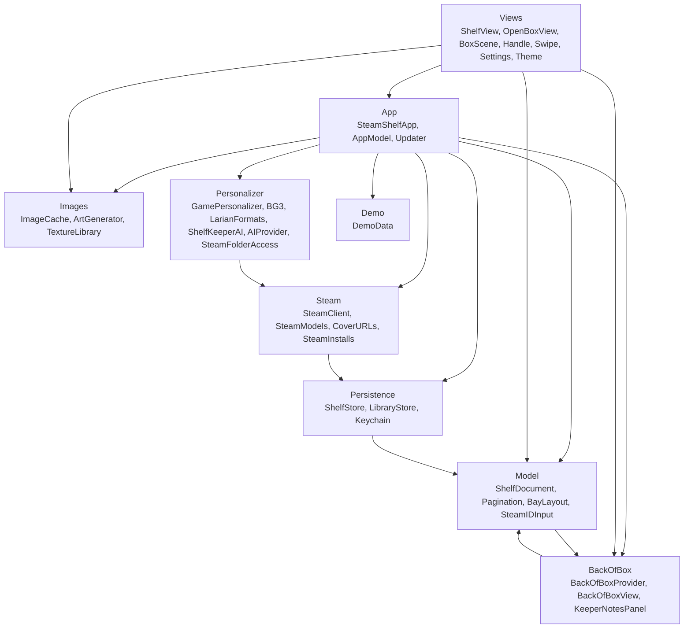
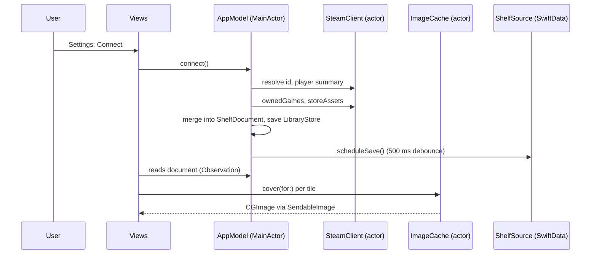

# Architecture overview

Steam Shelf is a native macOS app (macOS 15 and later, Swift 6 with complete strict concurrency, SwiftUI, RealityKit, SwiftData, Sparkle) that shows a Steam library as a skeuomorphic wooden bookshelf: the window is the bookcase, games are 2:3 boxes on four-by-four pages, and clicking a box lifts it into a 3D object whose back carries a rating, a note, hours and achievements. All user-authored data lives in one `Codable` value, `ShelfDocument`; everything else is a cache or a service around it. A single `@MainActor @Observable` object, `AppModel`, owns live state and is the only thing views talk to. The code is about 6,800 lines in 33 Swift files, grouped by folder into the modules shown below.

This page is the map. Read it first, then the seven subsystem pages in the order given at the end. File-level detail is in the [reference pages](../reference/AppModel.md); the visual spec is [DESIGN.md](../design/DESIGN.md); every decision is logged in [OPEN_QUESTIONS.md](../decisions/OPEN_QUESTIONS.md); how to build and run is in [build-and-run](../overview/build-and-run.md) and the [docs home](../README.md).

## Responsibilities

| Concern | Where it lives |
|---|---|
| Launch, scenes, menus, file type | `Sources/App/` |
| The one schema and pure model logic (ordering, pagination, layout math, ID parsing) | `Sources/Model/` |
| Talking to Steam (Web API, store CDN art, local client files) | `Sources/Steam/`, `Sources/Images/ImageCache.swift` |
| Storing things (SwiftData blob, library JSON, Keychain) | `Sources/Persistence/` |
| Procedural art (wood, linen, placeholder covers) and texture holder | `Sources/Images/ArtGenerator.swift` |
| Everything drawn on screen | `Sources/Views/`, `Sources/BackOfBox/` |
| Per-game save reading and the AI writer ("Shelf-Keeper") | `Sources/Personalizer/` |
| Fake data for the demo | `Sources/Demo/` |
| Packaging: signing, entitlements, updates | `project.yml`, `Resources/`, `scripts/` |

## How it works

### Module map

Arrows mean "uses". `Views` reach `App` through the SwiftUI environment (`@Environment(AppModel.self)`), not by importing singletons. The `Model <-> BackOfBox` pair is a real cycle at file level: `ShelfEntry` stores a `BackOfBoxContent`, and `BackOfBoxContext` is built from a `ShelfEntry`. `Personalizer -> Steam` is only `SteamInstalls.steamappsDirectory` (to preselect the folder picker) and `Persistence -> Steam` is `OwnedGame`/`StoreAssets` inside `OwnedLibraryCache`.

### Launch modes

| Mode | How selected | Behaviour |
|---|---|---|
| Normal | default | Persistent SwiftData store, `UserDefaults`, Keychain on demand, Sparkle starts, textures prepared, `onLaunch` loads the stored shelf and refreshes the library if it is older than 6 hours. |
| Demo | `--demo` launch argument (`make demo`), or "Try the Demo Shelf" / Settings | A **normal launch** that starts on the demo shelf: 40 of 50 imaginary games, procedural covers, no network art, no Play button, no Shelf-Keeper notes. Settings, "Leave Demo" and the updater still work. Edits live only in a `DemoShelfSource` in memory and are never saved. |
| Tests | `XCTestConfigurationFilePath` in the environment | In-memory SwiftData, no `UserDefaults` writes, no saves scheduled, no Sparkle, no textures, no swipe monitor. `onLaunch` is a no-op. |
| DEBUG-only flags | `--demo-notes`, `--dump-digest <appid>` | Seed sample Shelf-Keeper notes on the first demo entry; write the personalizer digest for a game to Caches without calling any AI. |

### The `ShelfDocument` is the single schema

`ShelfDocument` (version 1) holds the title, owner, timestamps, an `arrangement` (`alphabetical` or `custom`) and `entries: [ShelfEntry]` (rating, note, purchase date, first-seen date, cached stats, art URLs, optional `BackOfBoxContent`). It is:

- stored in SwiftData as one JSON blob (`ShelfRecord.documentData`), not a table per game;
- exported and imported as a `.steamshelf` JSON file (`forSharing()` keeps only shelved entries);
- the payload any future peer-to-peer transport would carry (art is public CDN URLs, no key needed).

Because the document is the schema, every format question (new fields, versioning) is answered in one file, `ShelfDocument.swift`; unknown keys are ignored on decode and `version > 1` is refused with a dedicated error. Details: [App and state](app-and-state.md).

### The main-actor rule

All UI and state is `@MainActor`: `AppModel`, `CoverLoader`, `TextureLibrary`, `BoxMotion`, `BoxBuilder`, `SwipeMonitor`, `Updater`, `SteamFolderAccess`, and the SwiftData `ShelfSource`s. Anything slow or blocking is pushed *off* the main actor into either a dedicated `actor` (`SteamClient`, `ImageCache`, `ShelfKeeperAI`, each holding its own `URLSession`) or a detached task (texture generation, save-file parsing). Only `Sendable` value types cross those boundaries; the project's single `@unchecked Sendable` is `SendableImage`, a wrapper for the immutable `CGImage`. The rule of thumb: **views never await the network directly; they call a method on `AppModel`**, which awaits an actor and then mutates its own state on the main actor.

### Where each kind of state lives

| State | Location | Notes |
|---|---|---|
| The shelf (`ShelfDocument`) | SwiftData `ShelfRecord` blob, `kindRaw == "local"` | Saved 500 ms after the last mutation (debounced). In-memory for demo and tests. |
| Library cache (owned games, first-seen dates, art asset names) | `<Application Support>/SteamShelf/library-<steamid>.json` | JSON; `firstSeen` cannot be rebuilt so it lives here, not in Caches. |
| Cover images and miss list | `<Caches>/SteamShelf/covers/<appid>.jpg`, `<appid>-header.jpg`, `misses.json` | Re-fetchable; negative cache of 7 days. |
| Preferences and mirrors | `UserDefaults` | Steam ID text, resolved SteamID, `hasAPIKey`, `aiKeyProviders`, `aiConfig` (JSON), `saveTimeZone`, `playerSummary` (JSON), `shelfLights`, and the Steam-folder security-scoped bookmark (`steamFolderBookmark`). Sparkle keeps its own keys here too. |
| Secrets | Keychain (login keychain, generic password, service `net.outofajam.SteamShelf`) | Steam Web API key (`steam-web-api-key`); one AI key per service (`anthropic-api-key` for Anthropic, `ai-key-<id>` for others). Launch never reads the Keychain; UserDefaults booleans mirror "has key". |
| Procedural textures | `TextureLibrary.shared` (memory) | Generated once per launch on a background task (about four 1024/512 px images). |
| Recent covers | `CoverLoader.recent` (memory, 48) and `ImageCache.memory` (200) | Lets the open-box overlay start instantly. |
| Open-box and paging state | `AppModel` properties | Never persisted. |
| Save files of games | Not stored by the app | Read on demand from the user-granted Steam folder; only a derived text digest is sent to an AI service, and the resulting notes are stored in the document (`BackOfBoxContent`). |

### One data flow end to end

## Key types

| Type | File | Role |
|---|---|---|
| `SteamShelfApp` | `App/SteamShelfApp.swift` | `@main`; scenes, commands, launch mode |
| `AppModel` | `App/AppModel.swift` | All live state and workflows |
| `ShelfDocument`, `ShelfEntry`, `ShelfDocumentCodec` | `Model/ShelfDocument.swift` | The schema and its JSON codec |
| `Pagination`, `BayLayout` | `Model/` | Pure paging and layout math |
| `ShelfSource`, `LocalShelfSource`, `DemoShelfSource`, `ShelfRecord` | `Persistence/ShelfStore.swift` | Storage seam |
| `SteamClient`, `SteamError` | `Steam/SteamClient.swift` | Web API access, error copy |
| `ImageCache` | `Images/ImageCache.swift` | Cover download, disk cache, dedupe |
| `ShelfView` and friends | `Views/ShelfView.swift` | Case, bay, planks, tiles, drag and drop |
| `OpenBoxView`, `BoxMotion`, `BoxStageView` | `Views/` | Open/close phase machine and 3D box |
| `BackOfBoxView`, `LabelEditorPanel`, `KeeperNotesPanel` | `BackOfBox/` | Back label, editing, AI notes UI |
| `GamePersonalizer`, `BG3Personalizer`, `LarianFormats` | `Personalizer/` | Save reading |
| `ShelfKeeperAI`, `AIConfig` | `Personalizer/` | AI writer and provider choice |

Full tables: each subsystem page and the [reference index](../reference/AppModel.md).

## Concurrency and isolation

- `AppModel` is `@MainActor @Observable`; SwiftUI tracks property reads, so views re-render only for the properties they touch.
- Actors: `SteamClient`, `ImageCache`, `ShelfKeeperAI`. All other service-like types are enums of static functions (`Keychain`, `LibraryStore`, `SteamInstalls`, `CoverURLs`, `LZ4`, `Zstd`, `LSF`) and are either pure or do short synchronous file I/O.
- Detached tasks: `TextureLibrary.prepare` (wood/linen generation) and the save-file digest in `AppModel.writeNotes`, which runs `SteamFolderAccess.withAccess` (a `nonisolated` function) on a `userInitiated` task.
- `BoxMotion` is main-actor but deliberately not `@Observable`: it changes every frame and no view should re-render from it.
- Cancellation: tile loads are SwiftUI `.task`s (cancelled when the tile leaves); the open/close sequences use a generation counter; the debounced save, transient status and drag dwell are `Task`s that are cancelled and replaced.
- The Swift 6 language mode with `SWIFT_STRICT_CONCURRENCY: complete` is set for both targets.

## Failure modes and how they surface to the user

| Failure | Surface |
|---|---|
| No key, bad key, private profile, offline, rate limit | `libraryState = .failed(copy)`: base rail text with a warning sign, and Settings status row with a Help disclosure ([Steam](steam.md)) |
| Cover art missing | Procedural placeholder cover; no error ([Shelf rendering](shelf-rendering.md)) |
| Stored shelf cannot be decoded | Treated as an empty shelf; the next edit overwrites it ([App and state](app-and-state.md)) |
| Export/import problem | Alert ("That file isn't a Steam Shelf document", newer-format message) |
| Save fails | Logged only (no UI) |
| Keychain write fails | Library state failure message (Steam key) or a log line (AI key) |
| Shelf-Keeper problems | Message and Try Again in the notes panel ([AI writer](ai-writer.md)) |
| SwiftData container cannot be created, or CGContext allocation fails | `fatalError` (no recovery path) |

## Tests

Seven XCTest files, all offline: layout math, pagination, document codec and model behaviour, Steam response parsing and install parsing, Larian format readers and the BG3 digest against synthetic fixtures, and AI request/response handling for both wire formats. Views, networking, Keychain and the release pipeline are not covered by automated tests. See [Tests](../reference/Tests.md).

## Related decisions

All in [OPEN_QUESTIONS.md](../decisions/OPEN_QUESTIONS.md): Q3 (2D shelf plus RealityKit box only when open; SceneKit ruled out), Q4 (blob not tables), Q17 (demo mode kept in release), Q18 (macOS 15 minimum, because of `RealityView`), [Phase A](../decisions/OPEN_QUESTIONS.md#implementation-notes-phase-a) (Keychain mirror in UserDefaults), [Phase B](../decisions/OPEN_QUESTIONS.md#implementation-notes-phase-b), [Phase C](../decisions/OPEN_QUESTIONS.md#implementation-notes-phase-c). The original plans in [docs/history](../history/ARCHITECTURE-v1-plan.md) are partly superseded: for example the plan's header bar became the `CrownRail`, and the planned `AIBackOfBoxProvider` was replaced by `ShelfKeeperAI` plus `AppModel.writeNotes`; where code and history differ, the code is right.

## Reading order for the other pages

1. [App and state](app-and-state.md): `AppModel`, the document, persistence, Keychain. Everything else hangs off it.
2. [Steam](steam.md): how data gets in (API, cover art, refresh rules, error copy).
3. [Shelf rendering](shelf-rendering.md): how the shelf is drawn and navigated.
4. [Open box](open-box.md): the open/close machine, the 3D box, the label and the Play button.
5. [Personalizer](personalizer.md): reading save files.
6. [AI writer](ai-writer.md): turning a digest into notes.
7. [Distribution](distribution.md): project settings, signing, Sparkle, releases.

## Reference

Per-file pages: [SteamShelfApp](../reference/SteamShelfApp.md), [AppModel](../reference/AppModel.md), [Updater](../reference/Updater.md), [ShelfDocument](../reference/ShelfDocument.md), [Pagination](../reference/Pagination.md), [BayLayout](../reference/BayLayout.md), [SteamIDInput](../reference/SteamIDInput.md), [ShelfStore](../reference/ShelfStore.md), [LibraryStore](../reference/LibraryStore.md), [Keychain](../reference/Keychain.md), [SteamClient](../reference/SteamClient.md), [SteamModels](../reference/SteamModels.md), [CoverURLs](../reference/CoverURLs.md), [SteamInstalls](../reference/SteamInstalls.md), [ImageCache](../reference/ImageCache.md), [ArtGenerator](../reference/ArtGenerator.md), [Theme](../reference/Theme.md), [ShelfView](../reference/ShelfView.md), [HandleView](../reference/HandleView.md), [SwipeMonitor](../reference/SwipeMonitor.md), [OpenBoxView](../reference/OpenBoxView.md), [BoxScene](../reference/BoxScene.md), [SettingsView](../reference/SettingsView.md), [BackOfBoxProvider](../reference/BackOfBoxProvider.md), [BackOfBoxView](../reference/BackOfBoxView.md), [KeeperNotesPanel](../reference/KeeperNotesPanel.md), [DemoData](../reference/DemoData.md), [GamePersonalizer](../reference/GamePersonalizer.md), [BG3Personalizer](../reference/BG3Personalizer.md), [LarianFormats](../reference/LarianFormats.md), [SteamFolderAccess](../reference/SteamFolderAccess.md), [ShelfKeeperAI](../reference/ShelfKeeperAI.md), [AIProvider](../reference/AIProvider.md), [Tests](../reference/Tests.md), [scripts](../reference/scripts.md), [tools/bg3](../reference/tools-bg3.md).
