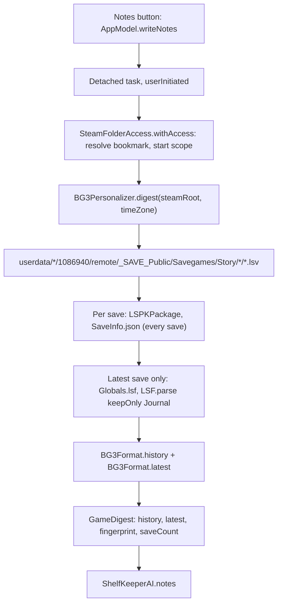

# Personalizer

The personalizer layer reads a game's local save files and boils them down to a plain-text *digest* that the AI writer ([AI writer](ai-writer.md)) turns into notes for the back of the box. It is split so that every piece is testable without a real save: a protocol (`GamePersonalizer`), a pure text formatter (`BG3Format`), file discovery for one game (`BG3Personalizer`), pure-Swift readers for Larian's binary formats (`LarianFormats`), and the sandbox plumbing that lets the app read the Steam folder once the user grants it (`SteamFolderAccess`). Today there is one personalizer, Baldur's Gate 3 (Steam appID 1086940).

## Responsibilities

- Obtain read access to the Steam folder with the user's explicit, revocable consent.
- Find a game's save files, read the cheap metadata of *every* save and the deep content of the *latest* one.
- Compute the facts a model would otherwise miscount (gaps, reloads, attendance, counts) in app code, and present everything as two text sections.
- Fingerprint the digest so stored notes record which saves they were written from.
- Fail safely on corrupt or unexpected files (bounds-checked readers; errors, never traps).

## How it works

### Pipeline



### Access: the Steam folder grant

Saves live under `~/Library/Application Support/Steam/userdata/`, which the App Sandbox does not allow reading. In Settings > Shelf-Keeper (or the notes panel) the user presses **Grant Access...**; `SteamFolderAccess.requestAccess()` shows an `NSOpenPanel` preselected at the Steam folder and requires the chosen folder to contain `userdata`. It stores a read-only **security-scoped bookmark** (`.withSecurityScope`, `.securityScopeAllowOnlyReadAccess`) in `UserDefaults` under `steamFolderBookmark`. The bookmark is not a secret (only this app can resolve it), this is Apple's documented pattern, and Keychain reads are what cause password prompts, so it is deliberately not in the Keychain. `withAccess(_:)` is `nonisolated`: it resolves the bookmark, starts the security scope, refreshes a stale bookmark, runs the closure and always stops the scope; it throws `noFolderAccess` otherwise. **Revoke** deletes the bookmark. Entitlements: `files.user-selected.read-write` and `files.bookmarks.app-scope` ([Distribution](distribution.md)).

### Digest contract

`GameDigest { history: String, latest: String, fingerprint: String, saveCount: Int }`. `GamePersonalizer.digest(steamRoot:timeZone:)` returns `nil` for "no saves found" and is **synchronous: call it off the main actor**. `timeZone` is where the saves were played; file modification dates carry no zone, so using the Mac's current zone would shift every clock time when the Mac travels (found when the Mac was on Honolulu time and every late-night save moved two hours earlier). Settings > Shelf-Keeper has a "Saves were played in" picker (default: this Mac's zone; stored as `saveTimeZone`), and the digest says which zone it used. Q23 asks whether to detect a home zone automatically; the default is no.

### BG3: finding saves

For each user folder in `<steamRoot>/userdata` the personalizer looks in `<user>/1086940/remote/_SAVE_Public/Savegames/Story/`. Each subfolder is named `<Hero>-<digits>__<Save Name>` (parsed by regex `^(.*)-(\d+)__(.*)$`; otherwise the whole name is both hero and save name) and contains one `.lsv` package; the file's modification date is the save time. Saves are sorted by date. A package whose `SaveInfo.json` cannot be read or parsed is skipped; if none are readable the digest throws `corrupt("no readable saves")`.

### BG3: `SaveInfo.json` and the history

Every save's `SaveInfo.json` (the only entry read from older saves) provides `Save Name`, `Difficulty`, `Game Version`, `Current Level` and `Active Party.Characters[]` (`Origin`, first class `Main`/`Sub`, `Level`, `Experience Points (Total)`). The **hero** is the folder prefix; a member with `Origin == "Generic"` is the hero or a custom character, a plain name is a companion, a name containing `_` is a summon (labelled quasit, wolf, raven or "summon").

`BG3Format.history` produces:

1. Header: `Heroes: <name> (n saves), ...` (by count), first and last save stamps, `Total saves`, the zone sentence ("All clock times are in <zone>, the zone the owner says the saves were played in."), the reload note, and `Columns: date | hero | save name | playtime | hero class | party`.
2. `COUNTED FOR YOU (use these figures; do not recount the list below):` followed by bullet lines from `patterns`.
3. `FULL LIST:` with one line per save: `yyyy-MM-dd HH:mm | hero | "save name" | 17h17m | L4 Ranger/BeastMaster | with Gale, Karlach`.

**Autosave collapsing**: consecutive autosaves (`AutoSave_` prefix) by the same hero on the same calendar day (in the chosen zone) collapse into one line `N autosaves`, using the last autosave's time, class and party; a run of one is shown normally. Playtime comes from the name (`17h 17m`) and is `-` when absent. If there are more than 250 lines only the most recent 250 are kept, with a note.

### BG3: the "COUNTED FOR YOU" patterns

Sonnet miscounted when asked to do arithmetic on the list (seven saves became nine, 73 minutes became 33), so the app computes the figures and the prompt forbids the model from counting. The patterns, all in the chosen time zone:

| Line | Rule |
|---|---|
| `Gap: <hero> went N days between "<save>" (<date>) and "<save>" (<date>); playtime advanced <span> across that gap.` | Consecutive saves of the same hero 30 or more calendar days apart; the playtime clause only when both names carry playtime and it did not go backwards |
| `Reload: <hero> saved "<a>" at HH:mm on <date>, then "<b>" <span> of real time later with <span> less playtime.` | Playtime *decreased* between consecutive saves of the same hero |
| `Saves by place for <hero>: Place n, ...` | Top five places parsed from `"<Place> - 17h 23m"` names |
| `Party attendance for <hero> (out of N saves): Name n, ...` | Companions present, one count per save |
| `The quasit first appears in "<save>" (<date>) and is in k of <hero>'s N saves.` | Saves whose party contains the quasit summon |
| `Saves made between midnight and 5 a.m.: k of N. The latest in the night was "<save>" at HH:mm.` | Hour 0 to 4 in the chosen zone |
| `Save names the player typed themselves (k): "<name>" (<stamp>); ...` | Names that are not autosaves and not exactly `<Place> - 17h 23m` (last 30) |
| `Autosaves: k of N saves.` | Always present |

Spans print as `<h>h <m>m` from 60 minutes, else `<m> minutes`.

### BG3: latest-save deep dive

For the most recent readable save the personalizer also reads `Globals.lsf` from the package and parses it with `LSF.parse(keepOnly: ["Journal"])`, so only the `Journal` subtree is materialised. `BG3Journal.extract` then pulls:

- `QuestCategories/QuestCategory` (`QuestID`, `CategoryID`) for completed and in-progress categories;
- `Quests` descendants `QuestsProgress` (`MapKey`, and the `ObjectiveID` of its `Quest` child) for open questlines;
- `DialogLogs/DialogLog` (`DLOG_FileName`, `DLOG_GameDay`) and each `DialogLogLine` (`RollSkill`, `RollAbility`, `RollIsPassive`, `RollIsSuccess`); a line is a roll only if skill is not 19 or ability is not 0.

`BG3Format.latest` prints: the save and hero; difficulty, game version, current area; one `Party member:` line per member (class/subclass, level, XP); `Completed quests (n)`; each other quest category and `Open questlines` (objectives ending `_COMPLETION` are done; `HIDDEN_` quests are hidden everywhere); the range of in-game days seen; `Recent conversations, oldest first (in-game day)` (repeats merged as `name xN (day a-b)`, last 40 runs, `.lsj` stripped); `Most frequent dialogs` (top five); and a dice tally by name with `passed`/`failed` counts and `(passive)` markers, most frequent first. Roll names come from numeric ids: skills 0 to 17 are Deception, Intimidation, Performance, Persuasion, Acrobatics, Sleight of Hand, Stealth, Arcana, History, Investigation, Nature, Religion, Athletics, Animal Handling, Insight, Medicine, Perception, Survival; skill 18 is a raw ability check named after ability 1 to 6 (Strength, Dexterity, Constitution, Intelligence, Wisdom, Charisma) as "<Ability> check". If `Globals.lsf` cannot be read the digest says `Journal unavailable.` and carries on.

The fingerprint is `"<saveCount>:<latest mtime epoch seconds>"` and is stored as the notes' `inputFingerprint`; the "N saves read" footer is parsed from its prefix.

### Example digest (synthetic)

An illustrative digest built only from the synthetic fixture values (hero "Corth", invented saves), shaped exactly as the formatter emits it. The history part:

```text
Heroes: Corth (5 saves)
First save: 2024-02-05 21:19; last save: 2025-01-18 02:30
Total saves: 5
All clock times are in UTC, the zone the owner says the saves were played in.
Note: a lower playtime than the previous save by the same hero means the player reloaded an earlier save.
Columns: date | hero | save name | playtime | hero class | party

COUNTED FOR YOU (use these figures; do not recount the list below):
- Reload: Corth saved "Putrid Bog - 17h 23m Astarion questions" at 21:19 on 2024-02-05, then "Putrid Bog - 17h 17m new attempt" 21 minutes of real time later with 6 minutes less playtime.
- Gap: Corth went 328 days between "Shattered Sanctum - 22h 35m" (2024-02-25) and "Campsite - 22h 45m" (2025-01-18); playtime advanced 10 minutes across that gap.
- Saves by place for Corth: Putrid Bog 2, Campsite 1, Shattered Sanctum 1.
- (party attendance, night-owl and typed-name lines omitted here)
- Autosaves: 1 of 5 saves.

FULL LIST:
2024-02-05 21:19 | Corth | "Putrid Bog - 17h 23m Astarion questions" | 17h23m | L4 Ranger/BeastMaster | with Gale
... (four more lines)
```

The latest-save part begins `Save: "<name>" (hero: Corth)`, then difficulty, game version and current area, one `Party member:` line each, and the quest, conversation and dice summaries described above. The prompt that wraps both parts is in [AI writer](ai-writer.md#the-prompts-verbatim). Size: a 118-save library produced about 12.6k input tokens in the live test recorded in the decision log.

### Adding another game

1. Implement `GamePersonalizer` (`appID`, `displayName`, `digest(steamRoot:timeZone:)`), reading saves under the granted Steam folder and returning the same two plain-text sections plus a fingerprint and save count.
2. Compute any numbers the model would be tempted to count and put them in a "COUNTED FOR YOU" block; the system prompt tells the model to use those figures and never to count rows itself.
3. Append the type to `Personalizers.all`. The Notes button, the Settings "Games with notes" list and `AppModel.writeNotes` find it through `Personalizers.forApp`.
4. Add synthetic fixtures (never real saves) and tests alongside `PersonalizerTests`.

### Larian formats (`LarianFormats.swift`)

Ports of `tools/bg3/lspk.py` and `tools/bg3/lsf.py`. Every read goes through `Bytes.int`/`Bytes.slice`, which throw `PersonalizerError.corrupt` instead of trapping; a single decompressed section is capped at 512 MiB.

**LZ4.** Apple's Compression framework cannot decode linked frame blocks, so a small decoder is included. `decodeBlock` appends to the output and resolves match offsets against everything already written (that is what makes *linked* blocks work), validating literal lengths, offsets and the output cap. `decodeFrame` parses the frame header (magic `0x184D2204`, version 1; optional content size, dictionary id, checksums are skipped) and decodes every block into one growing buffer.

**zstd.** `Zstd.decompress` calls `ZSTD_decompress` from the `libzstd` SwiftPM product (package `facebook/zstd` 1.5.7 or later) into a buffer of the declared size and checks `ZSTD_isError`.

**LSPK v18 (`.lsv`).** Header (22 bytes): `"LSPK"`, version `UInt32` (15 to 18 accepted), file-list offset `UInt64`. At that offset: file count and compressed size (`UInt32` each) and an LZ4 *block* decoding to `count * 272` bytes of entries: 256-byte NUL-terminated name, offset low `UInt32`, offset high `UInt16`, a flags byte at +263 whose low nibble is the compression method (0 stored, 2 LZ4 block, 3 zstd; 1 zlib is unsupported), size on disk, uncompressed size. A save contains `meta.lsf`, `SaveInfo.json` and `Globals.lsf`. Only the table is read at open time; `data(for:)` seeks and reads one entry.

**LSF v5 to v7.** Magic `"LSOF"`, version, 8 bytes of engine version, then section sizes as `UInt32` (uncompressed, on disk) pairs: five pairs for v6/v7 (names, keys, nodes, attributes, values), four for v5 (no keys); a compression byte (low nibble 0, 2 or 3), two filler fields and `metaFormat` (1 means the *long* node and attribute formats). Names are in an LZ4 block; the others are LZ4 *frames*. A name index is `bucket = idx >> 16`, `entry = idx & 0xFFFF`. **Long format:** 16-byte nodes (`nameIndex`, `parent`, `next`, `firstAttr`) and 16-byte attributes (`nameIndex`, type in the low 6 bits and length in the rest, `next`, value `offset`). **Short format:** 12-byte nodes (`nameIndex`, `firstAttr`, `parent`) and 12-byte attributes (`nameIndex`, type and length, owning node) where value offsets are cumulative and `next` links are rebuilt by chaining attributes of the same node. Values decode by type id: strings (20, 21, 22, 23, 29, 30), integers (1 to 5, 24, 26, 27, 32), floats (6, 7), booleans (19); everything else is `.other`. Parent indices must precede the node (else `corrupt`); attribute chains are cycle-checked.

**`keepOnly`.** With `keepOnly: ["Journal"]` the node table is still walked (parent links need it) but `LSFNode` objects are built only for kept roots and their descendants. This keeps memory low on a roughly 300,000-node `Globals.lsf` from a late-game save.

### Python references and fixtures

`tools/bg3/lspk.py` and `tools/bg3/lsf.py` are the Python originals used to learn the formats and to compare the Swift output against real saves (the DEBUG `--dump-digest <appid>` flag writes the digest to Caches for that comparison). They also produced `Tests/LarianFixtures.swift`: synthetic base64 blobs with no real save data (an LSPK v18 package with a stored `meta.lsf`, zstd `SaveInfo.json` and `Globals.lsf` whose inner sections are LZ4 linked frames; the same LSF tree uncompressed and LZ4-compressed; an LZ4 block vector). The fixture hero is "Corth" and the save "Goblin Camp CLEARED - 26h 12m". See [tools/bg3](../reference/tools-bg3.md) and [Tests](../reference/Tests.md).

## Key types

| Type | File | Role |
|---|---|---|
| `GamePersonalizer`, `GameDigest`, `PersonalizerError`, `Personalizers` | `Personalizer/GamePersonalizer.swift` | Protocol, digest, errors, registry |
| `BG3Personalizer`, `BG3Format`, `BG3SaveInfo`, `BG3SaveRecord`, `BG3Member`, `BG3Journal` | `Personalizer/BG3Personalizer.swift` | Discovery, formatting, journal extraction |
| `LZ4`, `Zstd`, `Bytes`, `LSPKPackage`, `LSF`, `LSFNode`, `LSFValue` | `Personalizer/LarianFormats.swift` | Binary readers |
| `SteamFolderAccess` | `Personalizer/SteamFolderAccess.swift` | Bookmark grant and scoped access |

## Concurrency and isolation

`GamePersonalizer` is `Sendable` and `digest` is synchronous and blocking: `AppModel.writeNotes` runs it inside `Task.detached(priority: .userInitiated)` and `SteamFolderAccess.withAccess` (a `nonisolated static` function; the rest of `SteamFolderAccess` is `@MainActor`). Results are `Sendable` value types. `LSFNode` is a non-`Sendable` class used only inside one synchronous parse/digest call, which is why `BG3Journal.extract` copies the data into `Sendable` structs before returning. `LSPKPackage` is `Sendable` (it stores a URL and a table, and opens a fresh `FileHandle` per read).

## Failure modes and how they surface to the user

| Failure | Result (message in the notes panel) |
|---|---|
| No Steam folder grant | "Steam Shelf doesn't have access to your Steam folder yet." with Grant Access |
| `userdata` unreadable or no `.lsv` files | `digest` returns nil, mapped to "No save files were found for this game." |
| All packages unreadable | `corrupt` becomes "The save files couldn't be read." (the internal reason is not shown) |
| Unsupported LSPK/LSF/LZ4 version or compression | Same message via `unsupported` |
| `Globals.lsf` unreadable | Notes are written from history and `SaveInfo.json` only; the digest says `Journal unavailable.` |
| Wrong time zone | Clock-time jokes (late-night saves) are off; the picker in Settings fixes it |

Copy comes from `KeeperText.message(for:)`.

## Tests

`LarianFormatsTests` (LZ4 vector and corruption, frame and zstd garbage, LSF plain vs LZ4 equivalence, `keepOnly`, truncation, LSPK package and truncation) and `BG3PersonalizerTests` (counted patterns including zone sensitivity, full digest from a synthetic Steam root, no-saves nil, folder parsing, party/playtime text, history format, autosave collapsing, 250-line cap, latest without a journal). Not covered: `SteamFolderAccess` (needs a real open panel) and real-world saves. See [Tests](../reference/Tests.md).

## Related decisions

[Shelf-Keeper notes](../decisions/OPEN_QUESTIONS.md#shelf-keeper-notes) (`keepOnly`, save-name rules, notes writable only on the local shelf), [Sonnet 5.5 default, counted facts, save time zone](../decisions/OPEN_QUESTIONS.md#sonnet-55-default-counted-facts-save-time-zone-2026-10-04), Q23. The original spec is [history/PERSONALIZER-spec.md](../history/PERSONALIZER-spec.md); source comments still cite it as `docs/PERSONALIZER.md`.

## Reference

[GamePersonalizer](../reference/GamePersonalizer.md), [BG3Personalizer](../reference/BG3Personalizer.md), [LarianFormats](../reference/LarianFormats.md), [SteamFolderAccess](../reference/SteamFolderAccess.md), [tools/bg3](../reference/tools-bg3.md), [Tests](../reference/Tests.md), [AppModel](../reference/AppModel.md), [SettingsView](../reference/SettingsView.md).
