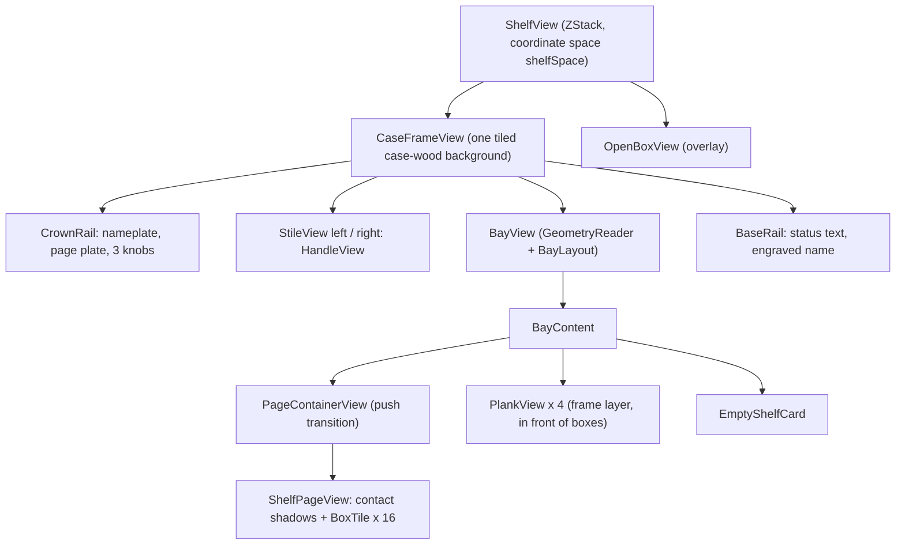

# Shelf rendering

The shelf is plain SwiftUI, not a 3D scene: the window itself is the bookcase (crown rail, two stiles with page handles, a flexible bay, a base rail), and the bay shows one page of sixteen boxes standing on four planks. Geometry comes from a pure value type, `BayLayout`; all artwork is drawn in code (procedural wood from a seeded generator, gradients, shadows) so the app ships no image assets for the shelf. Paging, drag-to-reorder, keyboard, menu, handle and trackpad-swipe navigation all funnel into a handful of `AppModel` methods.

## Responsibilities

- Compose the case frame and bay, and keep every proportion a function of the window size.
- Draw boxes from cover art (or generated placeholders), with hover, press, drag and drop affordances.
- Provide the shelf lights (warm LED strips) and the visual occlusion that makes boxes stand *behind* the plank edge.
- Animate page changes and respect Reduce Motion.
- Translate keyboard, menu, handle clicks and swipes into page changes; accept drags to reorder.
- Generate and hold the procedural textures.

## How it works

### View tree

`ShelfView` stacks `CaseFrameView` and `OpenBoxView` in a `ZStack` and names the coordinate space `"shelfSpace"`. Each `BoxTile` reports its frame in that space so the open-box overlay can fly a copy of the tile from exactly where it sits. The view is `.ignoresSafeArea()` so wood runs under the hidden title bar; the crown reserves 84 pt for the traffic-light buttons.

### Bay geometry (`BayLayout`)

Given the bay size (window minus crown, base and stiles), `BayLayout` computes a 4 x 4 grid of 2:3 boxes:

1. `rowH = height / 4`.
2. `boxH` is the smaller of what the row allows (`rowH / (1 + 22/180 + 20/180)`, i.e. headroom plus plank) and what the width allows (`((w - 2*28 - 3*14) / 4) * 1.5`). `boxW = boxH * 2/3`.
3. Preferred side padding is `max(28, boxH * 56/180)`. The gap is whatever fills the width, clamped to `[14, 0.75 * boxW]`; when the gap hits its ceiling, extra width goes to side padding instead, so a very wide window keeps the boxes grouped.
4. `scale = boxH / 180` (`Theme.Metrics.boxH`).

Worked example for the 700 x 888 design bay: `rowH = 222`, row limit 180, width limit about 226, so `boxH = 180`, `boxW = 120`, padding target 56, natural gap `(700 - 112 - 480) / 3 = 36`, side padding `(700 - 480 - 108) / 2 = 56`: the original design numbers (a unit test asserts them). The minimum window (820 x 700) gives a bay of roughly 652 x 592, where the box is width-limited.

`boxFrame(row:col:)` puts the box bottom `boxRestInset` below the plank's top edge; `plankFrame(row:)` is full width at the bottom of each row. `slot(containing:)` exists but the UI does not use it yet.

### The `shelfScale` environment value

`BayView` reads the bay size with a `GeometryReader`, builds the layout and injects `layout.scale` as `\.shelfScale`. Every hand-drawn component multiplies its design-unit constants (corner radii, shadows, strokes, fonts, handle size) by this scale, so a bigger window grows the tiles, handles and effects proportionally. Chrome outside the bay (crown, base, stile width) uses fixed points from `Theme.Metrics`.

### Z-order inside the bay, and why planks are in front

From back to front `BayContent` draws: tiled back panel; a darkening gradient; a per-row shadow cast by the crown or plank above (26 pt, reduced to 25% when lights are on); the per-row light strips (opacity 0 or 1); side shadows from the stiles; the page (clipped); the four planks; the empty-shelf card. The planks belong to the *frame layer*: they do not slide with the page. Because they are drawn after the page, and each box's bottom edge is positioned `boxRestInset` (0.75 of the plank's visible top surface, about 6 pt at scale 1) below the plank's top edge, the plank covers the base of every box. The result reads as boxes standing on the shelf with the shelf edge in front, instead of boxes pasted on top of it. Planks are `allowsHitTesting(false)` so they never block clicks. Each box also has a blurred ellipse contact shadow drawn behind it at the plank line.

### Procedural textures

`TextureLibrary.shared.prepare()` runs once (guarded and idempotent) on a detached `userInitiated` task: three 1024 x 1024 seeded wood textures (shelf planks horizontal grain seed 1, case frame vertical seed 2, back panel vertical seed 3) and a 512 x 512 linen texture (seed 4). Wood is built from a base fill, seven soft tone bands, 260 sine-wobble grain lines drawn at three vertical offsets and at integer frequencies (so the tile is seamless), two knots and 30,000 pores; a vertical grain is the same drawing rotated 90 degrees. Images are wrapped as `Image(decorative:scale: 2)`, so a 1024 px texture tiles at 512 pt. Until they exist, `TiledFill` shows a flat walnut colour; the wood fades in without layout change. Seeds are fixed so the wood is identical on every launch. The same generator renders placeholder covers (see below). Spec: [DESIGN section 3](../design/DESIGN.md).

### Box tiles

A `BoxTile` is a `Button` (so keyboard focus, accessibility trait and the "label = title" come for free) with:

- the cover, `2:3`, clipped to a 2 pt radius, a glossy overlay (top-left highlights) and, when lights are on, a warm top light;
- a spine sliver on the left (a parallelogram whose top rises by 0.375 of its width) and a thin top sliver, both in the *spine colour*: for a downloaded portrait that is a darkened, desaturated version of the cover's average colour (hue kept, saturation x 0.8, brightness 0.45 x clamped to 0.10 to 0.35); for placeholders it is the palette's bottom colour;
- hover: lift 3 pt, scale 1.03, glow stroke, deeper shadow, `Theme.Motion.hover`;
- while it is the opened box, the visible body is hidden and a faint slot outline remains (the flyer in the overlay stands in for it).

`CoverLoader` (one per tile, `@MainActor @Observable`) resolves the cover: a hit in the static `recent` cache (48 entries, shared with the open-box overlay) returns immediately; otherwise it yields once, asks `ImageCache` for a portrait, falls back to a header composite (landscape header on a portrait cover) or to a procedural placeholder (gradient from one of eight palettes chosen by `appID % 8`, a sunburst, accent rules, the title in Baskerville). Demo mode never hits the network. Tiles load via `.task(id: appID)`, so scrolling pages cancels stale loads. The art fades in over 0.25 s. Details of fetching: [Steam](steam.md).

### Shelf lights

The crown's bulb knob, **Shelf > Shelf Lights** (Cmd-L) or `toggleLights()` flips `lightsOn` (persisted, default off) with a 0.5 s ease. Per row a `LightStrip` is drawn under the crown or plank above: a tucked-away core line (`lampCore`), a short halo (`lampGlow`, plus-lighter blend) and a warm wash (`lampWash`, screen blend) that is hottest under the plank, is gone by about 70% of the row, and is masked to pool toward the centre and fade before the stiles. When lights are on, the under-plank shadow drops to 25%, planks get a warm top spill and a stronger top-surface highlight, covers get a soft warm top light and a bright top edge, and the whole thing is tuned to an amber of about 2700 K (Q21 asks whether a cooler cream would be better; the default is amber). The decision log: [Shelf lights](../decisions/OPEN_QUESTIONS.md#shelf-lights-2026-09-30).

### Page push animation

`PageContainerView` renders a single `ShelfPageView(pageIndex:layout:)` with `.id(model.pageIndex)`, so a page change replaces the view and runs `.transition(.push(from:))`. The edge is `.trailing` for forward and `.leading` for backward, taken from `model.slideDirection`, which `AppModel.go(to:)` sets in the same transaction as the animated `pageIndex` change (so the transition reads the right direction without making `go` asynchronous). With Reduce Motion the transition is `.opacity`. The page view applies `.animation(nil, value: layout)` so resizing the window never animates tile positions. Springs: `pageSlide` 0.55/0.86, `pageJump` 0.42/0.9 (double click, Home, End). The push was not verified mid-flight visually ([Phase B notes](../decisions/OPEN_QUESTIONS.md#implementation-notes-phase-b)).

### Navigation inputs

| Input | Handler | Notes |
|---|---|---|
| Click a handle | `HandleView` button, `model.handleTapped(side)` | Reads `NSApp.currentEvent.clickCount`: single = one page, double = first/last. Handles show the destination page number on a brass plate and dim at the ends. |
| Left/Right arrow, Home, End | `ShelfView.onKeyPress` | Ignored while a box is open or when a modifier is held. |
| Cmd-Left / Cmd-Right | `ShelfCommands` (Shelf menu) | Previous / Next Page. |
| Trackpad / Magic Mouse swipe | `SwipeMonitor` (local `NSEvent` monitor) | Two paths: scroll events with gesture phases accumulate `scrollingDeltaX` to a 60-pt threshold and fire once per gesture (momentum cannot fire again; mostly vertical scrolls are ignored); three-finger `.swipe` events use `deltaX`. Scoped to the "Steam Shelf" window and disabled while a box is open. |
| Drag a box over a handle | `StileView` drop target, `dragHover` | After a 450 ms dwell, flips one page so a box can be dragged across pages. |

### Drag to reorder

`DraggedBox { appID }` is `Transferable` via `CodableRepresentation(contentType: .steamShelfBox)`, with `net.outofajam.steamshelf.box` exported in `Info.plist` (conforming to `public.data`). Each `BoxTile` is `.draggable` (preview: the cover at box size) and a `.dropDestination`: dropping on a tile calls `moveEntry(dragged, before: thatTile)`, and while a drag hovers a brass-light insertion mark (3 pt, glowing) appears just left of the tile. Dropping on empty page background calls `moveEntry(dragged, before: nil)` and moves the box to the end. Dropping on a handle returns `false` (the handle is only a dwell target). Any successful move makes the arrangement custom and persists it; **Shelf > Arrange Alphabetically** resets. Moves are relative to the full `entries` array, which includes unticked games, so "before X" can leave unshelved entries between boxes in the stored order without any visible effect.

### Empty state and base rail

With no shelved entries the bay shows `EmptyShelfCard`, a 420 x 260 lined index card rotated -2 degrees with a thumbtack: "This shelf is bare." plus either the owned-game count or instructions, an **Open Settings** button and, if no library is loaded, **Try the Demo Shelf**. The base rail shows one line, recomputed each minute by a `TimelineView`: a transient message (for example "LAUNCHING <TITLE>..."), loading text, a warning with the failure text, or `UPDATED <relative> . n OF m TITLES SHELVED`, `DEMO SHELF . ...` or `NOT CONNECTED`.

## Key types

| Type | File | Role |
|---|---|---|
| `ShelfView` | `Views/ShelfView.swift` | Root, window-level input, file panels, startup |
| `CaseFrameView`, `CrownRail`, `BaseRail`, `StileView` | same | Frame members |
| `BayView`, `BayContent` | same | Layout host and layered content |
| `PlankView`, `LightStrip` | same | Planks, lighting |
| `PageContainerView`, `ShelfPageView` | same | Push transition, 4 x 4 grid |
| `BoxTile`, `CoverLoader`, `ReadyCover`, `DraggedBox` | same | Tile, cover resolution, drag payload |
| `EmptyShelfCard` | same | Empty state |
| `HandleView` | `Views/HandleView.swift` | Page handles |
| `SwipeMonitor` | `Views/SwipeMonitor.swift` | Swipe to page |
| `BayLayout`, `Pagination`, `HandleSide` | `Model/` | Pure geometry and paging |
| `Theme`, `shelfScale`, `TiledFill`, `BrassPlate`, `EngravedText`, `BrassPillButtonStyle`, `LinedPaper`, `Thumbtack` | `Views/Theme.swift` | Tokens and shared chrome |
| `TextureLibrary`, `ArtGenerator`, `CoverPalette`, `PlaceholderCoverView`, `HeaderCompositeCoverView`, `SplitMix64`, `SendableImage` | `Images/ArtGenerator.swift` | Procedural art |

## Concurrency and isolation

- All views, `CoverLoader`, `TextureLibrary`, `SwipeMonitor` and `HandleView` state are main-actor.
- Texture generation is a pure CPU function run on a detached task; results return as `SendableImage` and are wrapped into `Image` on the main actor.
- `ImageCache.cover(for:)` is an actor call awaited from the tile's `.task`; the result is a `Sendable` enum.
- `CoverLoader.recent` is a static dictionary protected by main-actor isolation of its class. Placeholder and header-composite covers are rendered through `ImageRenderer`, which must run on the main actor (`ArtGenerator.render` is `@MainActor`).
- `FrameBox` (a private reference holder for a tile's frame) is main-actor and read only at click time so frame changes do not invalidate the tile.
- `SwipeMonitor` handlers are `@MainActor` closures; the AppKit local monitor delivers on the main thread.

## Failure modes and how they surface to the user

| Failure | Result |
|---|---|
| Cover not downloadable (404, offline, non-image) | Placeholder cover with the title; a miss is remembered for 7 days; no error shown |
| Textures not ready yet | Flat walnut colour, then the wood appears when generation finishes |
| Window resized very small | Minimum 820 x 700; `BayLayout` clamps (gap and padding never below minimums; boxes shrink) |
| Drop of unknown payload or a handle drop | Ignored (`false`) |
| Rendering failure in `ImageRenderer` | Falls back to a flat blue-grey image (cover) or `nil` (the open-box textures then never build) |
| Out of memory in `CGContext` creation | `fatalError`; there is no useful recovery |

Memory: placeholder covers are 1200 x 1800 px, so a page of 16 placeholders holds about 140 MB of `CGImage`s (accepted in Phase A, unchanged).

## Tests

`BayLayoutTests` (design bay numbers, wide and narrow bays, boxes resting on planks, no overlap, hit testing) and `PaginationTests` cover the pure parts. Rendering, lighting, drag and swipe behaviour are verified by hand and with scripted screenshots (`build/tools`, not in git; see [Distribution](distribution.md#build-tools-not-in-git)). See [Tests](../reference/Tests.md).

## Related decisions

[Phase C notes](../decisions/OPEN_QUESTIONS.md#implementation-notes-phase-c) (bay math, empty card size, status line), Q2 (reorder), Q3 (2D shelf), Q15 (box depth), [Shelf lights](../decisions/OPEN_QUESTIONS.md#shelf-lights-2026-09-30), the visual spec [DESIGN.md](../design/DESIGN.md) (its sections 4, 6 and 10 are superseded by the Phase C case: see [Phase C plan](../history/PHASE_C-full-bleed-case.md)).

## Reference

[ShelfView](../reference/ShelfView.md), [HandleView](../reference/HandleView.md), [SwipeMonitor](../reference/SwipeMonitor.md), [Theme](../reference/Theme.md), [BayLayout](../reference/BayLayout.md), [Pagination](../reference/Pagination.md), [ArtGenerator](../reference/ArtGenerator.md), [ImageCache](../reference/ImageCache.md), [CoverURLs](../reference/CoverURLs.md), [AppModel](../reference/AppModel.md), [SteamShelfApp](../reference/SteamShelfApp.md).
