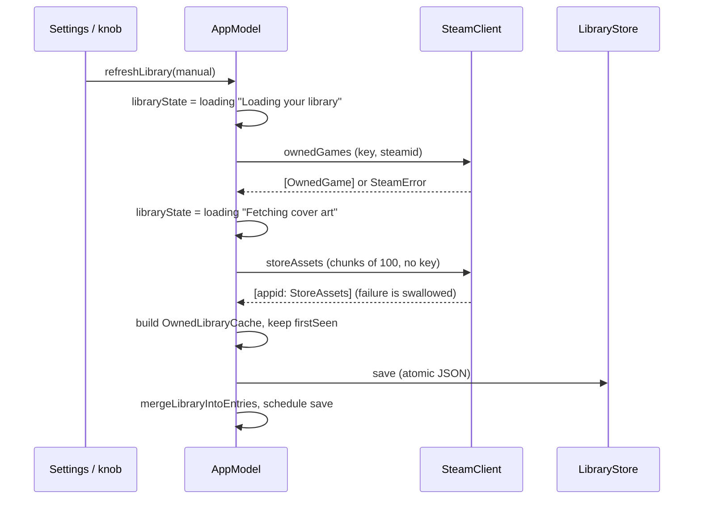

# Steam

Everything about getting data from Steam: the Steam Web API client (`SteamClient`, an actor with pure static parsers), the DTOs, the SteamID input parser, the cover-art URL rules, the image cache, and the read-only look at the local Steam client's files. The app needs the user's own Web API key and a public "Game details" privacy setting; it never logs into Steam and never sees a password. Data from Steam only fills the Steam-owned fields of the document (title, playtime, last played, achievements, art URLs); the user's rating, note and dates are never overwritten by a refresh.

## Responsibilities

- Parse a typed SteamID or profile URL, resolve a custom (vanity) URL, fetch the persona summary.
- Fetch owned games, store art asset names, and per-game achievement counts.
- Map every failure to a specific, actionable message.
- Turn art asset names into ordered candidate image URLs; download, cache, downscale and negatively cache images.
- Decide when to refresh.
- Read the Steam client's `libraryfolders.vdf` and app manifests (install state, game bundle) read-only ([Open box](open-box.md) uses it for Play/Install).

## How it works

### Endpoints

`SteamClient.apiBase = https://api.steampowered.com`. Every request adds `format=json` and has a 20 s timeout. Methods are `GET`; the key travels as the `key` query parameter, as Steam requires.

| Method | Path | Parameters | Parse function and mapping |
|---|---|---|---|
| `resolveSteamID` (vanity only) | `ISteamUser/ResolveVanityURL/v1/` | `key`, `vanityurl`, `url_type=1` | `parseVanity`: `response.success == 1` with a `steamid`, else `vanityNotFound`. A SteamID64 input skips the network. |
| `playerSummary` | `ISteamUser/GetPlayerSummaries/v2/` | `key`, `steamids` | `parseSummaries`: first of `response.players`, else `profileNotFound`. |
| `ownedGames` | `IPlayerService/GetOwnedGames/v1/` | `key`, `steamid`, `include_appinfo=1`, `include_played_free_games=1` | `parseOwnedGames`: when both `games` and `game_count` are absent the profile's game details are private, so `gameDetailsPrivate`; `game_count: 0` is an empty library. |
| `achievements` | `ISteamUserStats/GetPlayerAchievements/v1/` | `key`, `steamid`, `appid`, `l=english` | `parseAchievements(data, status:)`: parsed *before* the status is checked because 400/403 bodies here are JSON. `success:false` and "not public" gives `privateProfile`, "no stats" gives `noStats`, else `steam(message)`; if the body does not decode, `checkStatus`. Counts `achieved == 1` of the list length. |
| `storeAssets` | `IStoreBrowseService/GetItems/v1/` | `input_json` = `{"context":{"country_code":"US","language":"english"},"data_request":{"include_assets":true},"ids":[{"appid":N}...]}` (sorted keys), no key | `parseStoreItems`: items with `success == 1` and `assets`. IDs are de-duplicated, sorted and sent in chunks of 100; a failing chunk is logged and skipped, and only if *every* chunk fails is the last error thrown. |

`checkStatus`: 2xx fine, 401 and 403 `invalidKey`, 429 `rateLimited`, anything else `http(n)`. `get` maps `URLError` and other errors to `network(localizedDescription)` and passes `CancellationError` through. An envelope that does not decode is `decoding("<TypeName>")`. The parsers are static and pure, so unit tests call them with fixture JSON.

### DTOs (`SteamModels.swift`)

`OwnedGame` (`appid`, `name?`, `playtime_forever` minutes, `has_community_visible_stats?`, `rtime_last_played?` epoch with 0 meaning never, plus unused `img_icon_url` and `playtime_2weeks`), `PlayerSummary` (`steamid`, `personaname`, `profileurl?`, `avatarfull?`, `communityvisibilitystate?`; persisted in `UserDefaults`), `StoreAssets` (`asset_url_format?`, `library_capsule?`, `library_capsule_2x?`, `header?`), `AchievementSummary` (`earned`, `total`), and the envelope structs for each endpoint. Names keep Steam's snake_case so synthesized `Decodable` works. Stored fields of `OwnedGame` and `StoreAssets` must stay optional or an old library cache stops decoding.

### SteamID input (`SteamIDInput.parse`)

Accepts a bare SteamID64 (exactly 17 digits starting `7656119`), profile URLs on `steamcommunity.com` (http or https, optional `www.`, optional trailing slashes, `/profiles/<id>` or `/id/<name>`), or a bare vanity name (2 to 32 characters of letters, digits, `_`, `-`). All-digit strings that are not valid SteamID64s (for example 16 digits) are rejected, not treated as vanity names. The Connect button is disabled until the input parses; a failed parse shows `badSteamIDInput`.

### Cover art URLs and the candidate order

Steam serves store art from two kinds of CDN paths under `https://shared.akamai.steamstatic.com/store_item_assets/`:

- **Hashed** paths from `IStoreBrowseService`: `asset_url_format` is a template such as `steam/apps/<id>/${FILENAME}?t=<ts>` and the asset names (`library_capsule_2x`, `library_capsule`, `header`) carry the hash directory, giving `steam/apps/<id>/<hash>/library_600x900_2x.jpg?t=<ts>`.
- **Unhashed** legacy paths keyed by appID only: `steam/apps/<id>/library_600x900_2x.jpg` and `steam/apps/<id>/header.jpg`.

`CoverURLs.portraitCandidates(appID:assets:)` returns, in order and de-duplicated: hashed 2x, hashed 1x (both only when a format is known), unhashed 2x. `CoverURLs.header(appID:assets:)` is the hashed header when known, else the unhashed header. These URL lists are stored on `ShelfEntry.art` (`portraitURLs`, `headerURL`) at library refresh time; entries created later get them in `applyShelved`. In demo they are empty.

### Image cache (`ImageCache`)

`cover(for: CoverRequest) async -> CoverResult` (`portrait`, `header` or `none`) resolves in this order: memory (cap 200) then disk, then the 7-day miss list, then the network.

| Stage | Detail |
|---|---|
| Memory | `[appID: CoverResult]`; `.none` is not memoized. |
| In-flight dedupe | `[appID: Task<CoverResult, Never>]`; a second request for the same app awaits the first (keyed by appID only). |
| Disk | `<Caches>/SteamShelf/covers/<appID>.jpg` (portrait) or `<appID>-header.jpg`; the original downloaded bytes are stored. |
| Miss list | `covers/misses.json`: `{"<appID>": ISO date}`; a game with no art is not retried for 7 days. Checked after disk, so cached art always wins. |
| Network | Each portrait URL in order, then the header URL; HTTPS only, 20 s timeout, requires HTTP 200 and an `image/*` MIME type. First success is written to disk atomically. |
| Decode | ImageIO; anything above 1200 px on its long edge is decoded as a thumbnail (transform applied) so memory stays bounded. |
| Cancellation | A cancelled task returns `.none` without recording a miss. |

A header-only result is rendered as a header composite cover (see [Shelf rendering](shelf-rendering.md)); a header on disk means the portrait was unavailable when fetched and the portrait is not retried while that file exists.

### Refresh cadence

| Trigger | What runs |
|---|---|
| Launch, with a key and a resolved SteamID, if the cached library is missing or older than 6 h | `refreshLibrary(manual: false)`: owned games, then store assets only for games that have none cached |
| Connect (Settings) | resolve, summary, then `refreshLibrary(manual: true)` |
| Refresh knob, Cmd-R, Settings > Refresh Library | `refreshLibrary(manual: true)`: owned games and store assets for *all* games |
| Opening a box | `refreshStats(for:)`: achievements for that game only if it has community stats and was fetched more than 6 h ago |
| Edit Label > Refresh from Steam | `refreshStats(force: true)` |
| Settings > Refresh Achievements | `refreshAllStats()`: every shelved game, four at a time, forced |

Q13 sets 6 hours for both; the daily API limit is 100,000 calls, so there is slack either way. `has_community_visible_stats == false` (or missing) means achievements are never requested for that game and the label says "This game keeps no trophies." Free-to-play games the user has played are included (`include_played_free_games=1`, Q14). A manual refresh merges into the entries without adding or removing any: `mergeLibraryIntoEntries` updates title, playtime, last-played, community-stats flag and art URLs of existing entries only.

### Privacy and what is sent where

- To `api.steampowered.com`: the user's Web API key and SteamID, in the query string, over HTTPS. The store-browse call carries only appIDs.
- To `shared.akamai.steamstatic.com`: image requests by appID/hash; no identifiers.
- Locally: the key lives in the Keychain; `hasAPIKey` is mirrored in `UserDefaults`. The persona name and avatar URL are cached in `UserDefaults` and stored on the document's owner (and thus in exports).
- Steam only returns a user's game list when *Game details* is Public in Steam's privacy settings (Q16 records that research could not test live whether an owner's own key can see a private list; the app shows the fix-it message either way). Achievements need the profile to be public too.

### Error copy

| Case | Message shown |
|---|---|
| `missingKey` | Add your Steam Web API key first. |
| `invalidKey` | Steam rejected that API key. Double-check it at steamcommunity.com/dev/apikey. |
| `badSteamIDInput` | That doesn't look like a SteamID64 or a steamcommunity.com profile link. |
| `vanityNotFound` | No Steam profile uses that custom URL. |
| `profileNotFound` | Steam doesn't know that SteamID. |
| `gameDetailsPrivate` | Your game list is private. In Steam: Profile -> Edit Profile -> Privacy Settings -> set Game details to Public. |
| `privateProfile` | Achievements are private for this profile. |
| `noStats` | This game has no achievements. |
| `rateLimited` | Steam asked us to slow down. Try again in a few minutes. |
| `http(n)` | Steam returned an error (HTTP n). |
| `network(msg)` | Couldn't reach Steam: msg |
| `decoding` / `steam(msg)` | Steam sent something unexpected. (msg) |

`libraryState.failed(message)` shows in the base rail (upper-cased, with a warning sign) and in the Settings status row with a Help disclosure that explains the Game details setting.

## Key types

| Type | File | Role |
|---|---|---|
| `SteamClient`, `SteamError` | `Steam/SteamClient.swift` | Actor client, pure parsers, error copy |
| `OwnedGame`, `PlayerSummary`, `StoreAssets`, `AchievementSummary`, envelopes | `Steam/SteamModels.swift` | DTOs |
| `SteamIDInput` | `Model/SteamIDInput.swift` | Input parsing |
| `CoverURLs` | `Steam/CoverURLs.swift` | URL construction |
| `ImageCache`, `CoverRequest`, `CoverResult` | `Images/ImageCache.swift` | Download, cache, dedupe |
| `OwnedLibraryCache`, `LibraryStore` | `Persistence/LibraryStore.swift` | Library JSON |
| `SteamInstalls` | `Steam/SteamInstalls.swift` | Local client files |

## Concurrency and isolation

`SteamClient` and `ImageCache` are `actor`s, each with its own `URLSession` (`.shared` by default; injectable for tests). All DTOs are `Sendable`; images cross as `SendableImage`. `AppModel` (main actor) awaits the actors and applies results. `SteamClient`'s parsers are `static` and nonisolated. `refreshAllStats` limits concurrency to four in-flight achievement requests. `SteamInstalls` is synchronous and small, called on the main actor.

## Failure modes and how they surface to the user

| Failure | Surface |
|---|---|
| Any `SteamError` during connect or library refresh | Base rail warning and Settings status row (copy above); library and shelf stay as they were |
| Store asset fetch fails (all chunks) | Swallowed: covers use the unhashed URLs, which may 404 for hashed-only games, giving placeholders |
| One achievements fetch fails (not private, not "no stats") | Debug log only; label keeps "Checking the trophy case..." |
| `has_community_visible_stats` false | "This game keeps no trophies." (no request made) |
| Cancelled task | Treated as idle, not an error |
| Image missing or not an image | Placeholder cover, 7-day miss |
| `libraryfolders.vdf` unreadable | Install state unknown; Play still works |

## Tests

`SteamDecodingTests`: vanity, summaries, owned games (private, zero, missing name), achievements (ok, none, private, no stats, HTML 403), store items and the `input_json`, `checkStatus`, SteamID64 resolving without network, `libraryfolders.vdf` and manifest parsing, bundle picking. `CoverURLTests`: URL construction, candidate order, header choice and `SteamIDInput`. Not covered: live endpoints, `ImageCache`. See [Tests](../reference/Tests.md).

## Related decisions

Q1 (no purchase date from the Web API; manual field), Q7 (`appdetails` not fetched), Q13 (6 h cadence), Q14 (free-to-play included), Q16 (private game list message), [Phase A notes](../decisions/OPEN_QUESTIONS.md#implementation-notes-phase-a) (SteamID rule, key mirror), [Play / Install](../decisions/OPEN_QUESTIONS.md#play--install-2026-09-30). Research background: [RESEARCH.md](../history/RESEARCH.md) (partly superseded; the code is authoritative).

## Reference

[SteamClient](../reference/SteamClient.md), [SteamModels](../reference/SteamModels.md), [SteamIDInput](../reference/SteamIDInput.md), [CoverURLs](../reference/CoverURLs.md), [ImageCache](../reference/ImageCache.md), [LibraryStore](../reference/LibraryStore.md), [SteamInstalls](../reference/SteamInstalls.md), [AppModel](../reference/AppModel.md), [SettingsView](../reference/SettingsView.md), [Tests](../reference/Tests.md).
