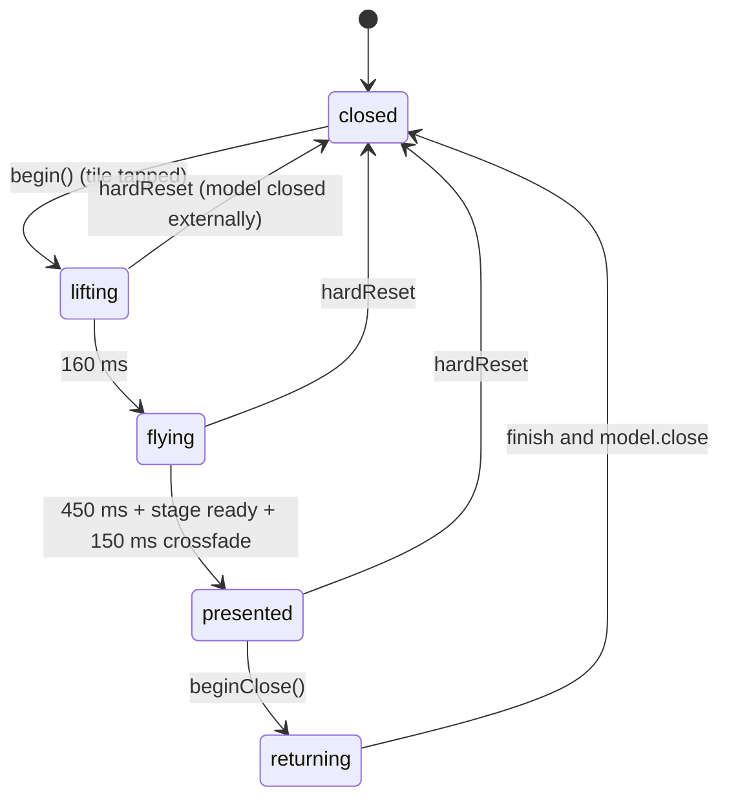

# OpenBoxView

Path: [`Sources/Views/OpenBoxView.swift`](../../Sources/Views/OpenBoxView.swift) (386 lines)

The overlay that opens a box. It layers, above the case frame, a dim backdrop, a 2D "flyer" copy of the tapped tile, the 3D stage, a toolbar and either side panel (label editor or Shelf-Keeper notes). It owns the open/close **phase machine**: lifting, flying to the stage, cross-fading to the 3D box, and the reverse on close. All fixed-duration sequences use `Task.sleep` guarded by a **generation counter** instead of animation completion callbacks.

## Depends on / used by

- Depends on: [AppModel](AppModel.md), [BoxScene](BoxScene.md) (`BoxMotion`, `BoxStageView`), [BackOfBoxView](BackOfBoxView.md) (`BackOfBoxView`, `SpineView`, `LabelEditorPanel`), [KeeperNotesPanel](KeeperNotesPanel.md), [ShelfView](ShelfView.md) (`ReadyCover`, `CoverLoader.recent`), [ArtGenerator](ArtGenerator.md), [Theme](Theme.md), [GamePersonalizer](GamePersonalizer.md) (`Personalizers.forApp`).
- Used by: [ShelfView](ShelfView.md) (second layer of the root `ZStack`).

## Types

| Type | Definition |
|---|---|
| `OpenPhase` | `enum: Equatable { closed, lifting, flying, presented, returning }` |
| `BoxTextures` (private) | `struct { front, back, spine: SendableImage; spineColor: Color }` |
| `OpenBoxView` | `struct: View` |

## State

`phase`, `cover: ReadyCover?`, flyer (`flyerRect`, `flyerScale`, `flyerShadow`, `flyerOpacity`), `dim`, `stageOpacity`, `toolbarOpacity`, `textures: BoxTextures?`, `stageReady`, `backVersion`, `motion: BoxMotion`, `generation`, `duScale` (design-unit scale of the originating tile), `overlaySize`/`overlayOrigin` (from `onGeometryChange` in `shelfSpace`), `backTask`, `@FocusState focused`; environment `accessibilityReduceMotion`.

## Geometry (computed properties)

| Property | Definition |
|---|---|
| `entry` | The opened `ShelfEntry` from `model.document` (re-read each time, so edits flow in). |
| `panelOpen`, `panelW` | A side panel is showing (editor or notes); width 340 (editor) or 380 (notes). |
| `bayRect` | Overlay rect minus crown (top), base (bottom) and stiles (left/right): `x = stileW`, `y = crownH`, `width = overlayW - 2*stileW`, `height = overlayH - crownH - baseH`. Derived from window size and frame metrics (not plumbed from `BayView`). |
| `stageSide` | `max(160, min(bay.width - reserved, bay.height - 100))` with `reserved = panelOpen ? panelW + 60 : 80`. The stage is a square confined to the bay, so the box never covers the frame. |
| `stageCenter` | Horizontal centre of the bay minus the panel strip; vertical centre of the bay. |
| `targetRect` | Where the flyer lands: height `frontFaceFill * stageSide`, width 2/3 of that, centred on `stageCenter`, shifted by `overlayOrigin` into `shelfSpace`. |
| `playLabel` | `"Play"` (installed or unknown) or `"Install"` (not installed), only when `model.canLaunchGames`. |
| `showsNotesButton` | AI notes with observations are stored, or `canWriteNotes` and a personalizer exists for the appID. |

## Body

When `phase != .closed`: backdrop `Color.black.opacity(0.7 * dim)` (tap closes only if `presented`); `BoxStageView` (once `textures` exist) sized and positioned by `stageSide`/`stageCenter`, double-click launches the game if `playLabel != nil`, `.id(generation)` so each open gets a fresh RealityView; the `flyer`; the `toolbar` positioned 24 + 15 pt below the front face (hit-testable only when `presented`); then `LabelEditorPanel` or `KeeperNotesPanel` at the bay's trailing edge (16 pt inset, height `max(120, bay.height - 32)`) when `phase == .presented`. The container allows hit testing only when `phase != .closed`.

Key handling (only when `presented` and no modifiers): Escape closes, Space flips, Left/Right rotate a quarter turn.

Change observers: `openedAppID` (non-nil while closed starts `begin()`; nil while open calls `hardReset()`), `entry` (schedules a back re-render), `isEditingLabel` and `isShowingNotes` (opening either calls `motion.showBack()`; closing returns focus).

## Toolbar (`toolbar`)

Buttons in `BrassPillButtonStyle`: **Play** or **Install** (when available), **Flip**, **Edit Label**/**Hide Label** (if `model.source.isEditable`), **Notes**/**Hide Notes** (if `showsNotesButton`), **Close** (`.cancelAction`). Opening one panel closes the other.

## Phase machine

| Function | Behaviour |
|---|---|
| `begin()` | `generation += 1`; captures `model.openedFromFrame`; `duScale = max(0.3, from.width / boxW)`; takes `CoverLoader.recent[appID]` or renders a placeholder; resets motion and visuals; places the flyer at the tile's frame with animations disabled. Task A: after `Task.yield()` builds all textures (`buildTextures`) so they are ready while the box moves. Task B: with Reduce Motion, jumps the flyer to `targetRect` and fades the dim in; otherwise `phase = .lifting` (scale 1.08, shadow 18, `Theme.Motion.lift`), sleeps 160 ms, `phase = .flying`, animates the flyer to `targetRect` (`Theme.Motion.fly`) and dims over 450 ms, sleeps 450 ms. Then `present(gen)`. Each step re-checks `gen == generation`. |
| `present(_ gen:) async` | Polls (up to 200 x 20 ms = 4 s) for `stageReady`; sets `motion.time = 0`; cross-fades `stageOpacity` to 1 and `flyerOpacity` to 0 (`Theme.Motion.crossfade`, 150 ms); `phase = .presented`; enables idle motion unless Reduce Motion; focuses; fades the toolbar in; calls `model.refreshInstalls()`, then `await model.refreshStats(for:)` and `await model.blurbIfNeeded(for:)`. |
| `beginClose()` | Only from `presented`. `phase = .returning`; idle off; cancels the back task; hides panels and toolbar; `motion.returnToFront()`. Then (task) waits up to 0.6 s for `motion.isSettled`, snaps the flyer to `targetRect`, cross-fades back to the flyer in 120 ms, springs the flyer to `model.openedFromFrame` (scale 1.08) while the dim fades over 380 ms (Reduce Motion: a 150 ms cross-fade instead), settles scale to 1 over 120 ms, then `finish()`. |
| `finish()` | `model.close()` then `reset()`. |
| `hardReset()` | `generation += 1` (orphaning any running sequence) then `reset()`. Used when the model closes the box from outside (for example leaving the demo). |
| `reset()` (private) | Cancels the back task, `phase = .closed`, drops textures and cover, cancels the motion subscription and `backEntity`, zeroes opacities. |
| `launchGame()` (private) | When presented: `model.launch(appID)` then `beginClose()`. |

### Textures

| Function | Behaviour |
|---|---|
| `renderBack(_:spineColor:)` (`@MainActor`) | `ArtGenerator.render(BackOfBoxView(entry:ownerName:spineColor:), size: 600 x 900)` wrapped in `SendableImage`. |
| `buildTextures(entry:cover:)` | Front = the cover image, back = `renderBack`, spine = `ArtGenerator.render(SpineView(title:color:), size: 200 x 1200)`. Returns `nil` if either render fails (the stage then never appears and the open sequence waits out the 4 s poll). |
| `scheduleBackRender()` | Debounced 150 ms re-render of the back after the entry changes; replaces `textures.back` and **increments `backVersion`** (which only ever increases) so `BoxStageView`'s `.task(id: backVersion)` swaps the 3D material. |

## Gotchas

- Fixed-duration `Task.sleep` rather than animation completion handlers: a completion that never fires (no value change) would leave the overlay stuck. The generation counter cancels stale sequences when a second open/close overlaps.
- `AppModel.close()` still sets `openedAppID = nil` instantly; user-initiated closes go through `beginClose()`, which animates first and calls `close()` at the end.
- `openedFromFrame` is kept live by the opened tile, so resizing the window while a box is open still lets it land in its slot.
- With the editor open at the minimum window (820 x 700) the stage is only about 252 pt square; accepted ([Phase C notes](../decisions/OPEN_QUESTIONS.md#implementation-notes-phase-c)).
- `buildTextures` runs on the main actor (ImageRenderer), tens of milliseconds, overlapped with the lift animation.

## See also

[Open box](../architecture/open-box.md), [Design spec](../design/DESIGN.md) (section 7).
